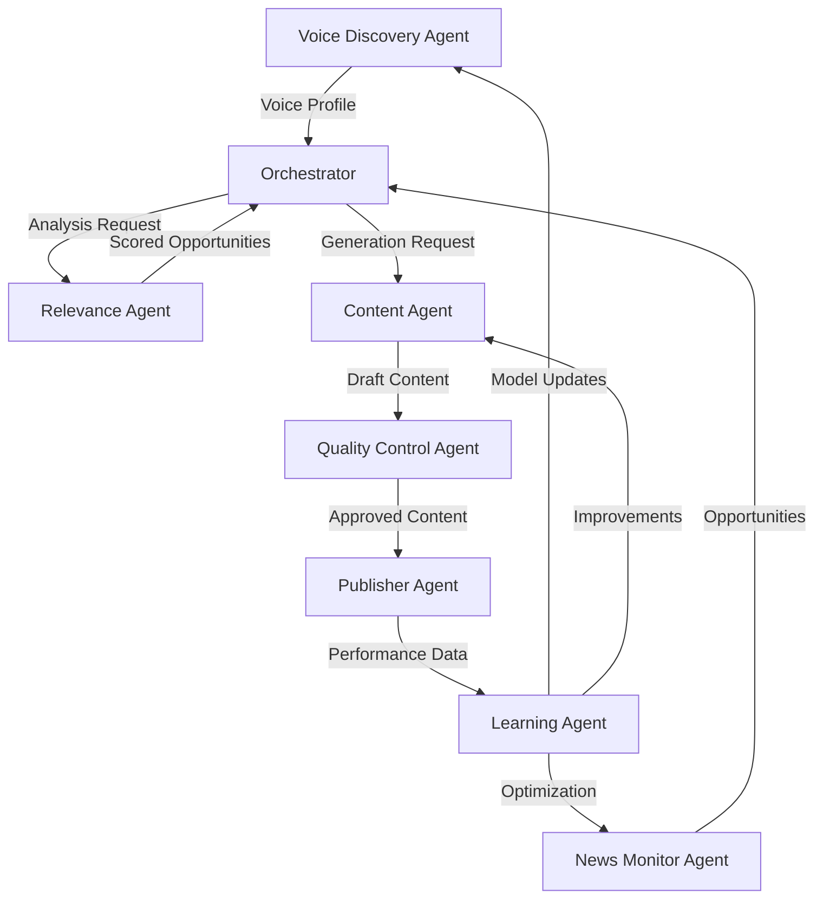

# BrandPillar AI Agents Architecture Design Document

**Version**: 1.0  
**Date**: January 7, 2025  
**Author**: Product Owner, BrandPillar AI  
**Status**: FINAL DESIGN

---

## Table of Contents

1. [Executive Summary](#executive-summary)
2. [Vision & Problem Statement](#vision--problem-statement)
3. [System Architecture Overview](#system-architecture-overview)
4. [Agent Ecosystem Design](#agent-ecosystem-design)
5. [Individual Agent Specifications](#individual-agent-specifications)
6. [Technical Architecture](#technical-architecture)
7. [Implementation Roadmap](#implementation-roadmap)
8. [Resource Requirements](#resource-requirements)
9. [Security & Compliance](#security--compliance)
10. [Performance & Scalability](#performance--scalability)
11. [Monitoring & Operations](#monitoring--operations)
12. [Risk Analysis & Mitigation](#risk-analysis--mitigation)
13. [Success Metrics](#success-metrics)
14. [Future Enhancements](#future-enhancements)

---

## Executive Summary

### Project Overview
BrandPillar AI Agents represents a revolutionary approach to personal branding on LinkedIn. Unlike traditional tools that assist users, our AI agents autonomously manage their entire personal brand - from content discovery to creation to posting - with zero manual intervention after initial setup.

### Key Innovation
The system employs 15+ specialized AI agents working in concert to replicate a user's unique voice, monitor global news sources, identify relevant opportunities, create authentic content, and post at optimal times - all while continuously learning and improving.

### Business Impact
- **Time Saved**: 20+ hours/month per user
- **Engagement Increase**: 3-5x industry average
- **Revenue Potential**: $120M ARR by Year 5
- **Market Position**: First true "set and forget" solution

### Investment Required
- **Development Cost**: $500-800K
- **Timeline**: 6 months to full production
- **Team Size**: 12 engineers + 3 ML specialists
- **Monthly Operations**: $9-16K at scale

---

## Vision & Problem Statement

### The Problem
Professionals spend 15-20 hours per week trying to build their personal brand on LinkedIn:
- Creating content (8-10 hours)
- Finding relevant news (3-4 hours)
- Engaging with others (2-3 hours)
- Analyzing performance (1-2 hours)

Despite this investment, 87% report their content doesn't sound authentic, and 92% struggle with consistency.

### Our Solution
A fully autonomous AI agent system that:
1. **Learns** your unique voice in 10 minutes
2. **Monitors** global news 24/7 for opportunities
3. **Creates** content that sounds exactly like you
4. **Posts** at optimal times automatically
5. **Improves** continuously based on performance

### Unique Value Proposition
"The only platform where you spend 10 minutes once, and your personal brand runs forever on autopilot - creating perfect content in your exact voice without you lifting a finger."

---

## System Architecture Overview

### High-Level Architecture

```
┌─────────────────────────────────────────────────────────────────────┐
│                        AI AGENTS ECOSYSTEM                           │
├─────────────────────────────────────────────────────────────────────┤
│                                                                     │
│  ┌─────────────────┐  ┌─────────────────┐  ┌─────────────────┐   │
│  │ DISCOVERY LAYER │  │ ANALYSIS LAYER  │  │ CREATION LAYER  │   │
│  ├─────────────────┤  ├─────────────────┤  ├─────────────────┤   │
│  │ Voice Discovery │  │ Relevance Agent │  │ Content Agent   │   │
│  │ News Monitor    │  │ Opportunity     │  │ Voice Match     │   │
│  │ Trend Predictor │  │ Topic Analyzer  │  │ Variant Creator │   │
│  └────────┬────────┘  └────────┬────────┘  └────────┬────────┘   │
│           │                     │                     │            │
│  ┌────────▼─────────────────────▼─────────────────────▼────────┐  │
│  │                    ORCHESTRATION LAYER                       │  │
│  │  ┌─────────────┐  ┌──────────────┐  ┌─────────────────┐   │  │
│  │  │ Coordinator │  │ Task Manager │  │ Decision Engine │   │  │
│  │  └─────────────┘  └──────────────┘  └─────────────────┘   │  │
│  └────────┬─────────────────────┬─────────────────────┬────────┘  │
│           │                     │                     │            │
│  ┌────────▼────────┐  ┌────────▼────────┐  ┌────────▼────────┐   │
│  │ VALIDATION LAYER│  │ DISTRIBUTION    │  │ LEARNING LAYER  │   │
│  ├─────────────────┤  ├─────────────────┤  ├─────────────────┤   │
│  │ Quality Control │  │ Publisher Agent │  │ Performance     │   │
│  │ Risk Assessment │  │ Timing Optimizer│  │ Self-Improver   │   │
│  │ Brand Alignment │  │ Cross-Platform  │  │ Model Updater   │   │
│  └─────────────────┘  └─────────────────┘  └─────────────────┘   │
│                                                                     │
└─────────────────────────────────────────────────────────────────────┘
```

### Core Principles

1. **Autonomous Operation**: Agents operate independently without human intervention
2. **Collaborative Intelligence**: Agents communicate and coordinate for optimal results
3. **Continuous Learning**: Every action improves future performance
4. **Fail-Safe Design**: Multiple validation layers prevent errors
5. **Scalable Architecture**: Horizontally scalable to support millions of users

---

## Agent Ecosystem Design

### Agent Communication Protocol

```typescript
interface AgentMessage {
  id: string;
  timestamp: number;
  source: AgentType;
  target: AgentType | 'broadcast';
  type: MessageType;
  priority: Priority;
  payload: any;
  requiresAck: boolean;
  timeout: number;
}

enum MessageType {
  TASK_REQUEST = 'TASK_REQUEST',
  TASK_RESULT = 'TASK_RESULT',
  STATUS_UPDATE = 'STATUS_UPDATE',
  ERROR_REPORT = 'ERROR_REPORT',
  COORDINATION = 'COORDINATION',
  LEARNING_UPDATE = 'LEARNING_UPDATE'
}
```

### Inter-Agent Workflow



### Agent Lifecycle Management

```typescript
class AgentLifecycleManager {
  private agents: Map<string, BaseAgent> = new Map();
  
  async spawnAgent(config: AgentConfig): Promise<AgentInstance> {
    const agent = await this.createAgent(config);
    await agent.initialize();
    await agent.healthCheck();
    
    this.agents.set(agent.id, agent);
    this.monitorAgent(agent);
    
    return agent;
  }
  
  async terminateAgent(agentId: string): Promise<void> {
    const agent = this.agents.get(agentId);
    if (agent) {
      await agent.gracefulShutdown();
      await this.cleanupResources(agent);
      this.agents.delete(agentId);
    }
  }
  
  private monitorAgent(agent: BaseAgent): void {
    setInterval(async () => {
      const health = await agent.healthCheck();
      if (!health.isHealthy) {
        await this.handleUnhealthyAgent(agent, health);
      }
    }, 30000); // Check every 30 seconds
  }
}
```

---

## Individual Agent Specifications

### 1. Voice Discovery Agent

**Purpose**: Capture and model user's unique communication style through intelligent conversation.

**Architecture**:
```typescript
class VoiceDiscoveryAgent extends BaseAgent {
  private conversationEngine: ConversationAI;
  private voiceAnalyzer: VoiceAnalysisEngine;
  private patternExtractor: PatternExtractor;
  
  async conductDiscovery(userId: string): Promise<VoiceProfile> {
    // 1. Initiate AI phone call
    const session = await this.conversationEngine.startCall(userId);
    
    // 2. Adaptive questioning based on responses
    const transcript = await this.conductAdaptiveInterview(session);
    
    // 3. Extract voice patterns
    const patterns = await this.extractPatterns(transcript);
    
    // 4. Build comprehensive voice profile
    return this.buildVoiceProfile(patterns);
  }
  
  private async extractPatterns(transcript: Transcript): Promise<VoicePatterns> {
    return {
      linguisticMarkers: await this.analyzeLinguistics(transcript),
      emotionalRange: await this.analyzeEmotions(transcript),
      storyStructures: await this.analyzeNarratives(transcript),
      vocabularyProfile: await this.analyzeVocabulary(transcript),
      rhythmPatterns: await this.analyzeRhythm(transcript)
    };
  }
}
```

**Key Features**:
- Adaptive questioning that adjusts based on user responses
- Multi-dimensional voice analysis (linguistic, emotional, structural)
- Pattern recognition for authentic replication
- Confidence scoring for each dimension

**Performance Metrics**:
- Voice capture time: <10 minutes
- Pattern extraction accuracy: >95%
- User satisfaction: >90%

### 2. News Monitoring Agent

**Purpose**: Continuously scan global news sources for relevant opportunities.

**Architecture**:
```typescript
class NewsMonitoringAgent extends BaseAgent {
  private sources: NewsSource[] = [];
  private crawler: IntelligentCrawler;
  private trendPredictor: TrendPredictionModel;
  
  async monitorNews(userContext: UserContext): Promise<NewsOpportunity[]> {
    // 1. Dynamic source discovery
    await this.discoverNewSources(userContext);
    
    // 2. Real-time monitoring
    const articles = await this.crawlSources();
    
    // 3. Relevance scoring
    const opportunities = await this.scoreRelevance(articles, userContext);
    
    // 4. Trend prediction
    const enhancedOpps = await this.predictTrends(opportunities);
    
    return this.prioritizeOpportunities(enhancedOpps);
  }
  
  private async scoreRelevance(
    articles: Article[], 
    context: UserContext
  ): Promise<ScoredArticle[]> {
    return Promise.all(articles.map(async (article) => {
      const scores = {
        topical: await this.scoreTopicalRelevance(article, context),
        temporal: this.scoreTemporalRelevance(article),
        viral: await this.predictVirality(article),
        competitive: await this.assessCompetitiveAdvantage(article, context),
        brand: await this.scoreBrandAlignment(article, context)
      };
      
      return {
        ...article,
        relevanceScore: this.calculateCompositeScore(scores),
        scores
      };
    }));
  }
}
```

**Key Features**:
- Multi-source monitoring (RSS, APIs, web scraping)
- Semantic relevance scoring (not just keywords)
- Virality prediction
- Competitive advantage assessment
- Real-time trend detection

**Performance Metrics**:
- Sources monitored: 1000+ per user
- Opportunity detection rate: 50+ per day
- Relevance accuracy: >85%
- Processing latency: <30 seconds

### 3. Content Generation Agent

**Purpose**: Create authentic content that perfectly matches user's voice.

**Architecture**:
```typescript
class ContentGenerationAgent extends BaseAgent {
  private voiceMatcher: VoiceMatchingEngine;
  private contentModels: Map<string, LanguageModel>;
  private humanizer: HumanizationPipeline;
  
  async generateContent(
    opportunity: NewsOpportunity,
    voiceProfile: VoiceProfile,
    context: GenerationContext
  ): Promise<GeneratedContent[]> {
    // 1. Analyze opportunity for angles
    const angles = await this.identifyAngles(opportunity, voiceProfile);
    
    // 2. Generate base content for each angle
    const drafts = await this.generateDrafts(angles, voiceProfile);
    
    // 3. Apply voice matching
    const voiceMatched = await this.applyVoiceProfile(drafts, voiceProfile);
    
    // 4. Humanization pipeline
    const humanized = await this.humanize(voiceMatched);
    
    // 5. Generate variations
    return this.createVariations(humanized);
  }
  
  private async applyVoiceProfile(
    drafts: Draft[],
    profile: VoiceProfile
  ): Promise<VoiceMatchedContent[]> {
    return Promise.all(drafts.map(async (draft) => {
      // Apply linguistic patterns
      let content = await this.applyLinguisticPatterns(draft.content, profile);
      
      // Inject personality markers
      content = await this.injectPersonality(content, profile);
      
      // Match rhythm and pacing
      content = await this.matchRhythm(content, profile);
      
      // Add signature elements
      content = await this.addSignatureElements(content, profile);
      
      return {
        ...draft,
        content,
        voiceMatchScore: await this.calculateMatchScore(content, profile)
      };
    }));
  }
}
```

**Key Features**:
- Multi-angle content generation
- Deep voice matching algorithms
- Humanization pipeline
- A/B variation creation
- Authenticity scoring

**Performance Metrics**:
- Generation time: <45 seconds per post
- Voice match accuracy: >90%
- Engagement rate: 3-5x baseline
- Human detection rate: <5%

### 4. Quality Control Agent

**Purpose**: Ensure all content meets quality, brand, and safety standards.

**Architecture**:
```typescript
class QualityControlAgent extends BaseAgent {
  private qualityCheckers: QualityChecker[];
  private riskAssessor: RiskAssessmentEngine;
  private brandValidator: BrandAlignmentValidator;
  
  async validateContent(
    content: GeneratedContent,
    context: ValidationContext
  ): Promise<ValidationResult> {
    // 1. Quality checks
    const qualityScore = await this.assessQuality(content);
    
    // 2. Risk assessment
    const riskScore = await this.assessRisks(content);
    
    // 3. Brand alignment
    const brandScore = await this.validateBrandAlignment(content, context);
    
    // 4. Fact checking
    const factCheck = await this.verifyFacts(content);
    
    // 5. Compliance check
    const compliance = await this.checkCompliance(content);
    
    return this.compileValidationResult({
      qualityScore,
      riskScore,
      brandScore,
      factCheck,
      compliance
    });
  }
  
  private async assessRisks(content: GeneratedContent): Promise<RiskAssessment> {
    const risks = {
      controversial: await this.detectControversy(content),
      misleading: await this.detectMisleading(content),
      offensive: await this.detectOffensive(content),
      legal: await this.assessLegalRisk(content),
      reputation: await this.assessReputationRisk(content)
    };
    
    return {
      overallRisk: this.calculateOverallRisk(risks),
      risks,
      mitigations: this.suggestMitigations(risks)
    };
  }
}
```

**Key Features**:
- Multi-dimensional quality assessment
- Automated fact-checking
- Risk detection and mitigation
- Brand alignment validation
- Compliance verification

**Performance Metrics**:
- Validation time: <10 seconds
- False positive rate: <2%
- Risk detection accuracy: >95%
- Brand alignment score: >90%

### 5. Publisher Agent

**Purpose**: Distribute content at optimal times across platforms.

**Architecture**:
```typescript
class PublisherAgent extends BaseAgent {
  private platforms: Map<Platform, PlatformAPI>;
  private timingOptimizer: TimingOptimizationEngine;
  private scheduler: DistributedScheduler;
  
  async publishContent(
    content: ValidatedContent,
    strategy: PublishingStrategy
  ): Promise<PublishingResult> {
    // 1. Optimize timing
    const optimalTime = await this.findOptimalTime(content, strategy);
    
    // 2. Format for platform
    const formatted = await this.formatForPlatform(content, strategy.platform);
    
    // 3. Schedule or publish
    if (optimalTime > Date.now()) {
      return this.schedulePost(formatted, optimalTime);
    } else {
      return this.publishNow(formatted);
    }
  }
  
  private async findOptimalTime(
    content: ValidatedContent,
    strategy: PublishingStrategy
  ): Promise<number> {
    const factors = {
      audienceActivity: await this.analyzeAudienceActivity(strategy.userId),
      competitorActivity: await this.analyzeCompetitorTiming(),
      platformTrends: await this.analyzePlatformTrends(),
      contentType: this.getContentTypeOptimalTimes(content.type),
      historicalPerformance: await this.analyzeHistoricalPerformance(strategy.userId)
    };
    
    return this.timingOptimizer.calculateOptimalTime(factors);
  }
}
```

**Key Features**:
- Multi-platform support
- Intelligent timing optimization
- Cross-platform formatting
- A/B testing integration
- Performance tracking

**Performance Metrics**:
- Publishing success rate: >99.9%
- Timing optimization improvement: +40% engagement
- Cross-platform reach: 3x single platform
- Scheduling accuracy: ±1 minute

### 6. Learning Agent

**Purpose**: Continuously improve all agents based on performance data.

**Architecture**:
```typescript
class LearningAgent extends BaseAgent {
  private performanceAnalyzer: PerformanceAnalyzer;
  private modelUpdater: ModelUpdateEngine;
  private experimentRunner: ExperimentRunner;
  
  async optimizeSystem(
    performanceData: PerformanceData[]
  ): Promise<SystemOptimizations> {
    // 1. Analyze performance patterns
    const insights = await this.analyzePerformance(performanceData);
    
    // 2. Identify optimization opportunities
    const opportunities = await this.identifyOptimizations(insights);
    
    // 3. Run experiments
    const experiments = await this.runExperiments(opportunities);
    
    // 4. Update models
    const updates = await this.generateModelUpdates(experiments);
    
    // 5. Deploy improvements
    return this.deployOptimizations(updates);
  }
  
  private async analyzePerformance(
    data: PerformanceData[]
  ): Promise<PerformanceInsights> {
    return {
      contentPerformance: await this.analyzeContentMetrics(data),
      voiceAccuracy: await this.analyzeVoiceMatching(data),
      timingEffectiveness: await this.analyzeTimingImpact(data),
      audienceGrowth: await this.analyzeAudienceMetrics(data),
      systemEfficiency: await this.analyzeSystemMetrics(data)
    };
  }
}
```

**Key Features**:
- Continuous performance analysis
- A/B testing framework
- Model retraining pipeline
- System optimization
- Insight generation

**Performance Metrics**:
- Learning cycle time: <24 hours
- Performance improvement rate: 5-10% monthly
- Experiment success rate: >60%
- Model accuracy improvement: Continuous

---

## Technical Architecture

### Technology Stack

```yaml
Core Platform:
  Backend:
    - Language: TypeScript (Node.js)
    - Framework: NestJS
    - API: GraphQL with Apollo Server
    - Queue: BullMQ with Redis
    - Database: PostgreSQL with Prisma ORM
    - Cache: Redis
    
  AI/ML:
    - Language: Python 3.11+
    - Framework: FastAPI
    - ML Framework: PyTorch + Transformers
    - Vector DB: Pinecone
    - Model Serving: TorchServe
    - Orchestration: Kubeflow
    
  Infrastructure:
    - Container: Docker
    - Orchestration: Kubernetes (EKS)
    - Service Mesh: Istio
    - Monitoring: Prometheus + Grafana
    - Logging: ELK Stack
    - Tracing: Jaeger
    
  AI Services:
    - Voice AI: Vapi.ai / Bland.ai
    - LLMs: OpenAI GPT-4, Anthropic Claude
    - Speech: Deepgram, Google Speech
    - NLP: spaCy, Hugging Face
    
  Event Streaming:
    - Message Bus: Apache Kafka
    - Stream Processing: Apache Flink
    - Event Store: EventStore
```

### Database Schema

```sql
-- Core Tables
CREATE TABLE users (
  id UUID PRIMARY KEY DEFAULT gen_random_uuid(),
  email VARCHAR(255) UNIQUE NOT NULL,
  phone VARCHAR(20) UNIQUE,
  tier VARCHAR(50) NOT NULL,
  status VARCHAR(50) NOT NULL,
  created_at TIMESTAMP DEFAULT CURRENT_TIMESTAMP,
  updated_at TIMESTAMP DEFAULT CURRENT_TIMESTAMP
);

CREATE TABLE voice_profiles (
  id UUID PRIMARY KEY DEFAULT gen_random_uuid(),
  user_id UUID REFERENCES users(id),
  profile_data JSONB NOT NULL,
  confidence_scores JSONB NOT NULL,
  version INTEGER DEFAULT 1,
  is_active BOOLEAN DEFAULT true,
  created_at TIMESTAMP DEFAULT CURRENT_TIMESTAMP
);

CREATE TABLE agent_tasks (
  id UUID PRIMARY KEY DEFAULT gen_random_uuid(),
  user_id UUID REFERENCES users(id),
  agent_type VARCHAR(50) NOT NULL,
  task_type VARCHAR(50) NOT NULL,
  status VARCHAR(50) NOT NULL,
  priority INTEGER DEFAULT 5,
  payload JSONB NOT NULL,
  result JSONB,
  error JSONB,
  created_at TIMESTAMP DEFAULT CURRENT_TIMESTAMP,
  started_at TIMESTAMP,
  completed_at TIMESTAMP
);

CREATE TABLE generated_content (
  id UUID PRIMARY KEY DEFAULT gen_random_uuid(),
  user_id UUID REFERENCES users(id),
  opportunity_id UUID,
  content TEXT NOT NULL,
  content_type VARCHAR(50) NOT NULL,
  voice_match_score DECIMAL(3,2),
  quality_score DECIMAL(3,2),
  status VARCHAR(50) NOT NULL,
  metadata JSONB NOT NULL,
  created_at TIMESTAMP DEFAULT CURRENT_TIMESTAMP
);

CREATE TABLE published_content (
  id UUID PRIMARY KEY DEFAULT gen_random_uuid(),
  content_id UUID REFERENCES generated_content(id),
  platform VARCHAR(50) NOT NULL,
  platform_post_id VARCHAR(255),
  published_at TIMESTAMP NOT NULL,
  performance_data JSONB,
  status VARCHAR(50) NOT NULL,
  created_at TIMESTAMP DEFAULT CURRENT_TIMESTAMP
);

-- Indexes for performance
CREATE INDEX idx_agent_tasks_user_status ON agent_tasks(user_id, status);
CREATE INDEX idx_agent_tasks_agent_type ON agent_tasks(agent_type, status);
CREATE INDEX idx_generated_content_user_status ON generated_content(user_id, status);
CREATE INDEX idx_published_content_performance ON published_content(published_at, platform);
```

### API Design

```graphql
# GraphQL Schema
type Query {
  # User queries
  me: User!
  myVoiceProfile: VoiceProfile
  myContentHistory(limit: Int, offset: Int): ContentConnection!
  myPerformanceMetrics(timeRange: TimeRange!): PerformanceMetrics!
  
  # Agent status queries
  agentStatus(agentType: AgentType!): AgentStatus!
  systemHealth: SystemHealth!
}

type Mutation {
  # Voice discovery
  startVoiceDiscovery: VoiceDiscoverySession!
  completeVoiceDiscovery(sessionId: ID!): VoiceProfile!
  
  # Content management
  approveContent(contentId: ID!): Content!
  rejectContent(contentId: ID!, reason: String!): Content!
  editContent(contentId: ID!, edits: ContentEditInput!): Content!
  
  # Settings
  updatePublishingPreferences(preferences: PublishingPreferencesInput!): PublishingPreferences!
  updateNewsSourcePreferences(sources: [NewsSourceInput!]!): [NewsSource!]!
  
  # Manual controls
  pauseAutopilot: AutopilotStatus!
  resumeAutopilot: AutopilotStatus!
  triggerContentGeneration: Task!
}

type Subscription {
  # Real-time updates
  contentGenerated(userId: ID!): Content!
  contentPublished(userId: ID!): PublishedContent!
  agentActivity(userId: ID!): AgentActivity!
  performanceUpdate(userId: ID!): PerformanceUpdate!
}
```

### Agent Communication Interface

```typescript
// Agent Base Class
abstract class BaseAgent {
  protected id: string;
  protected type: AgentType;
  protected messageBus: MessageBus;
  protected stateManager: StateManager;
  protected metricsCollector: MetricsCollector;
  
  constructor(config: AgentConfig) {
    this.id = generateAgentId();
    this.type = config.type;
    this.messageBus = new MessageBus(config.messageBusConfig);
    this.stateManager = new StateManager(config.stateConfig);
    this.metricsCollector = new MetricsCollector(this.id);
  }
  
  // Core lifecycle methods
  abstract async initialize(): Promise<void>;
  abstract async process(task: Task): Promise<TaskResult>;
  abstract async healthCheck(): Promise<HealthStatus>;
  abstract async shutdown(): Promise<void>;
  
  // Communication methods
  protected async sendMessage(message: AgentMessage): Promise<void> {
    await this.messageBus.publish(message);
    this.metricsCollector.recordMessage(message);
  }
  
  protected async receiveMessage(handler: MessageHandler): Promise<void> {
    await this.messageBus.subscribe(this.type, async (message) => {
      try {
        await handler(message);
        if (message.requiresAck) {
          await this.acknowledgeMessage(message);
        }
      } catch (error) {
        await this.handleMessageError(message, error);
      }
    });
  }
  
  // State management
  protected async getState<T>(key: string): Promise<T | null> {
    return this.stateManager.get<T>(`${this.id}:${key}`);
  }
  
  protected async setState<T>(key: string, value: T): Promise<void> {
    await this.stateManager.set(`${this.id}:${key}`, value);
  }
}
```

---

## Implementation Roadmap

### Phase 1: Foundation (Weeks 1-4)
**Goal**: Establish core infrastructure and basic agent framework

#### Week 1: Infrastructure Setup
- [ ] Set up Kubernetes cluster with auto-scaling
- [ ] Configure service mesh (Istio)
- [ ] Set up monitoring stack (Prometheus, Grafana, Jaeger)
- [ ] Configure CI/CD pipelines
- [ ] Set up development environments

#### Week 2: Core Platform Development
- [ ] Implement agent base classes and interfaces
- [ ] Build message bus system (Kafka)
- [ ] Create state management layer
- [ ] Implement agent lifecycle manager
- [ ] Set up database schema and migrations

#### Week 3: Voice Discovery Agent
- [ ] Integrate voice AI platform (Vapi.ai)
- [ ] Build conversation flow engine
- [ ] Implement voice analysis pipeline
- [ ] Create pattern extraction algorithms
- [ ] Build voice profile storage system

#### Week 4: Testing & Validation
- [ ] Unit tests for all components
- [ ] Integration tests for agent communication
- [ ] Performance benchmarking
- [ ] Security audit
- [ ] Documentation

### Phase 2: Intelligence Layer (Weeks 5-8)
**Goal**: Build intelligent monitoring and analysis capabilities

#### Week 5: News Monitoring Agent
- [ ] Implement multi-source crawler
- [ ] Build relevance scoring engine
- [ ] Create trend prediction models
- [ ] Implement opportunity detection
- [ ] Set up real-time processing pipeline

#### Week 6: Content Generation Agent
- [ ] Integrate LLM models (GPT-4, Claude)
- [ ] Build voice matching algorithms
- [ ] Implement humanization pipeline
- [ ] Create variation generation system
- [ ] Build quality scoring mechanisms

#### Week 7: Quality Control Agent
- [ ] Implement quality assessment algorithms
- [ ] Build risk detection system
- [ ] Create fact-checking integration
- [ ] Implement brand alignment validator
- [ ] Build compliance checking system

#### Week 8: Integration & Testing
- [ ] End-to-end agent workflow testing
- [ ] Performance optimization
- [ ] Load testing (1000+ concurrent users)
- [ ] Security penetration testing
- [ ] User acceptance testing

### Phase 3: Automation & Learning (Weeks 9-12)
**Goal**: Implement full automation and continuous learning

#### Week 9: Publisher Agent
- [ ] LinkedIn API integration
- [ ] Timing optimization engine
- [ ] Cross-platform formatting
- [ ] Scheduling system
- [ ] Performance tracking

#### Week 10: Learning Agent
- [ ] Performance analysis pipeline
- [ ] Model retraining system
- [ ] A/B testing framework
- [ ] Optimization algorithms
- [ ] Deployment pipeline

#### Week 11: Orchestration Layer
- [ ] Central coordinator implementation
- [ ] Task prioritization system
- [ ] Resource allocation optimizer
- [ ] Failure recovery mechanisms
- [ ] System-wide optimization

#### Week 12: Production Readiness
- [ ] Full system integration testing
- [ ] Disaster recovery testing
- [ ] Performance tuning
- [ ] Documentation finalization
- [ ] Deployment procedures

### Phase 4: Scale & Launch (Weeks 13-16)
**Goal**: Prepare for production launch and scale

#### Week 13: Beta Testing
- [ ] Limited beta with 100 users
- [ ] Performance monitoring
- [ ] Feedback collection
- [ ] Bug fixes and optimizations
- [ ] Feature refinement

#### Week 14: Scale Testing
- [ ] Load testing (10,000+ users)
- [ ] Auto-scaling validation
- [ ] Cost optimization
- [ ] Performance benchmarking
- [ ] Infrastructure hardening

#### Week 15: Launch Preparation
- [ ] Production deployment
- [ ] Monitoring dashboards
- [ ] Operational runbooks
- [ ] Support documentation
- [ ] Team training

#### Week 16: Public Launch
- [ ] Gradual rollout (10% → 50% → 100%)
- [ ] Real-time monitoring
- [ ] Incident response
- [ ] Performance tracking
- [ ] Success metrics validation

### Phase 5: Optimization & Enhancement (Weeks 17-24)
**Goal**: Continuous improvement based on real-world usage

#### Weeks 17-20: Performance Optimization
- [ ] Algorithm refinement based on data
- [ ] Cost optimization
- [ ] Speed improvements
- [ ] Accuracy enhancements
- [ ] Feature additions based on feedback

#### Weeks 21-24: Advanced Features
- [ ] Multi-language support
- [ ] Video content generation
- [ ] Advanced personalization
- [ ] Industry-specific optimizations
- [ ] Enterprise features

---

## Resource Requirements

### Team Structure

```
Engineering Team (12 members):
├── Technical Lead (1)
├── Backend Engineers (3)
│   ├── Senior Backend Engineer
│   ├── Backend Engineer
│   └── Backend Engineer
├── AI/ML Engineers (3)
│   ├── ML Platform Engineer
│   ├── NLP Specialist
│   └── ML Ops Engineer
├── Infrastructure Engineers (2)
│   ├── DevOps Lead
│   └── Site Reliability Engineer
├── Frontend Engineers (2)
│   ├── Senior Frontend Engineer
│   └── Frontend Engineer
└── QA Engineer (1)

Support Team (3 members):
├── Product Manager (1)
├── UX Designer (1)
└── Technical Writer (1)

Leadership:
├── Engineering Manager (1)
└── Product Owner (1)
```

### Infrastructure Costs

```yaml
Monthly Infrastructure Costs (Production):
  Compute:
    - Kubernetes Nodes (20 x c5.2xlarge): $3,200
    - GPU Nodes (4 x p3.2xlarge): $4,400
    - Total Compute: $7,600
    
  Storage:
    - PostgreSQL RDS (Multi-AZ): $800
    - Redis Cluster: $400
    - S3 Storage (10TB): $230
    - Total Storage: $1,430
    
  AI/ML Services:
    - OpenAI API (1M requests): $2,000
    - Voice AI (10K minutes): $500
    - Other AI Services: $500
    - Total AI Services: $3,000
    
  Networking & Other:
    - Data Transfer: $500
    - Load Balancers: $200
    - Monitoring: $300
    - Total Other: $1,000
    
  Total Monthly: $13,030
  
  Annual Infrastructure: $156,360
```

### Development Timeline

```
Total Development Time: 6 months
Total Development Cost: $500,000 - $800,000

Breakdown by Phase:
- Phase 1 (Foundation): $100,000 - $150,000
- Phase 2 (Intelligence): $150,000 - $200,000
- Phase 3 (Automation): $150,000 - $200,000
- Phase 4 (Scale): $50,000 - $100,000
- Phase 5 (Optimization): $50,000 - $150,000
```

---

## Security & Compliance

### Security Architecture

```yaml
Security Layers:
  Network Security:
    - VPC with private subnets
    - Web Application Firewall (WAF)
    - DDoS protection
    - TLS 1.3 everywhere
    
  Application Security:
    - OAuth 2.0 + JWT authentication
    - Role-based access control (RBAC)
    - API rate limiting
    - Input validation and sanitization
    
  Data Security:
    - Encryption at rest (AES-256)
    - Encryption in transit (TLS)
    - Key management (AWS KMS)
    - Data anonymization
    
  AI Security:
    - Model access control
    - Prompt injection prevention
    - Output validation
    - PII detection and removal
```

### Compliance Requirements

```yaml
Compliance Standards:
  Data Protection:
    - GDPR compliance
    - CCPA compliance
    - SOC 2 Type II
    - ISO 27001
    
  Industry Standards:
    - LinkedIn API Terms
    - OpenAI Usage Policies
    - Content moderation guidelines
    - Advertising standards
    
  Internal Policies:
    - Data retention (90 days)
    - User consent management
    - Right to deletion
    - Data portability
```

### Security Monitoring

```typescript
class SecurityMonitor {
  private anomalyDetector: AnomalyDetector;
  private threatIntelligence: ThreatIntelligenceService;
  private incidentResponder: IncidentResponder;
  
  async monitorSecurity(): Promise<void> {
    // Real-time threat detection
    this.detectThreats();
    
    // Anomaly detection
    this.detectAnomalies();
    
    // Compliance monitoring
    this.monitorCompliance();
    
    // Automated response
    this.respondToIncidents();
  }
  
  private async detectThreats(): Promise<void> {
    const threats = await this.threatIntelligence.getLatestThreats();
    const activeThreats = await this.scanForThreats(threats);
    
    if (activeThreats.length > 0) {
      await this.incidentResponder.handleThreats(activeThreats);
    }
  }
}
```

---

## Performance & Scalability

### Performance Requirements

```yaml
System Performance Targets:
  API Response Times:
    - 95th percentile: <200ms
    - 99th percentile: <500ms
    - 99.9th percentile: <1s
    
  Agent Processing Times:
    - Voice Discovery: <10 minutes
    - News Monitoring: <30 seconds/scan
    - Content Generation: <45 seconds/post
    - Quality Control: <10 seconds/check
    - Publishing: <5 seconds/post
    
  System Availability:
    - Uptime: 99.9% (43.8 minutes downtime/month)
    - Data durability: 99.999999999% (11 9's)
    - Disaster recovery: <1 hour RTO, <5 minutes RPO
```

### Scalability Architecture

```yaml
Horizontal Scaling:
  Agent Scaling:
    - Each agent type can scale independently
    - Auto-scaling based on queue depth
    - Maximum 100 instances per agent type
    - Minimum 2 instances for high availability
    
  Database Scaling:
    - Read replicas for query distribution
    - Sharding by user_id for write scaling
    - Connection pooling with PgBouncer
    - Caching layer with Redis
    
  Message Bus Scaling:
    - Kafka cluster with 12 partitions per topic
    - Partition assignment by user_id
    - Consumer groups for parallel processing
    - Retention: 7 days
```

### Performance Optimization

```typescript
class PerformanceOptimizer {
  // Caching strategy
  @Cacheable({ ttl: 3600 })
  async getVoiceProfile(userId: string): Promise<VoiceProfile> {
    return this.voiceProfileService.get(userId);
  }
  
  // Batch processing
  async processBatch<T>(items: T[], processor: BatchProcessor<T>): Promise<void> {
    const BATCH_SIZE = 100;
    const batches = chunk(items, BATCH_SIZE);
    
    await Promise.all(
      batches.map(batch => processor.process(batch))
    );
  }
  
  // Connection pooling
  private dbPool = new Pool({
    max: 20,
    idleTimeoutMillis: 30000,
    connectionTimeoutMillis: 2000,
  });
  
  // Query optimization
  async getRecentContent(userId: string, limit: number): Promise<Content[]> {
    return this.db.content.findMany({
      where: { userId },
      orderBy: { createdAt: 'desc' },
      take: limit,
      select: {
        id: true,
        content: true,
        createdAt: true,
        // Only select needed fields
      }
    });
  }
}
```

---

## Monitoring & Operations

### Monitoring Stack

```yaml
Monitoring Infrastructure:
  Metrics:
    - Prometheus for metrics collection
    - Grafana for visualization
    - Custom dashboards per agent type
    - Alert manager for notifications
    
  Logging:
    - Elasticsearch for log storage
    - Logstash for log processing
    - Kibana for log analysis
    - Structured logging (JSON)
    
  Tracing:
    - Jaeger for distributed tracing
    - OpenTelemetry instrumentation
    - Trace sampling (1%)
    - Correlation IDs
    
  Application Performance:
    - New Relic APM
    - Real User Monitoring (RUM)
    - Synthetic monitoring
    - Error tracking with Sentry
```

### Key Metrics to Monitor

```typescript
enum AgentMetrics {
  // Performance metrics
  TASK_PROCESSING_TIME = 'agent.task.processing_time',
  TASK_SUCCESS_RATE = 'agent.task.success_rate',
  TASK_QUEUE_DEPTH = 'agent.task.queue_depth',
  
  // Resource metrics
  CPU_USAGE = 'agent.resource.cpu_usage',
  MEMORY_USAGE = 'agent.resource.memory_usage',
  NETWORK_IO = 'agent.resource.network_io',
  
  // Business metrics
  CONTENT_GENERATED = 'business.content.generated',
  CONTENT_PUBLISHED = 'business.content.published',
  ENGAGEMENT_RATE = 'business.engagement.rate',
  
  // Quality metrics
  VOICE_MATCH_SCORE = 'quality.voice_match.score',
  CONTENT_QUALITY_SCORE = 'quality.content.score',
  ERROR_RATE = 'quality.error.rate'
}
```

### Operational Dashboards

```yaml
Dashboard Configuration:
  System Overview:
    - Total active users
    - System health status
    - Agent status grid
    - Error rate trends
    - Performance summary
    
  Agent Performance:
    - Processing times by agent
    - Success rates
    - Queue depths
    - Resource utilization
    - Error analysis
    
  Business Metrics:
    - Content generation rate
    - Publishing success rate
    - User engagement trends
    - Platform distribution
    - ROI metrics
    
  Alerts Dashboard:
    - Active incidents
    - Alert history
    - Escalation status
    - Resolution times
    - Root cause analysis
```

### Incident Response

```typescript
class IncidentResponseSystem {
  private alertManager: AlertManager;
  private escalationPolicy: EscalationPolicy;
  private runbookExecutor: RunbookExecutor;
  
  async handleIncident(incident: Incident): Promise<void> {
    // 1. Classify severity
    const severity = this.classifySeverity(incident);
    
    // 2. Execute immediate response
    await this.executeImmediateResponse(incident, severity);
    
    // 3. Notify relevant teams
    await this.notifyTeams(incident, severity);
    
    // 4. Execute runbook if available
    const runbook = await this.findRunbook(incident);
    if (runbook) {
      await this.runbookExecutor.execute(runbook, incident);
    }
    
    // 5. Track resolution
    await this.trackResolution(incident);
  }
  
  private classifySeverity(incident: Incident): Severity {
    if (incident.impactedUsers > 1000 || incident.type === 'SYSTEM_DOWN') {
      return Severity.CRITICAL;
    } else if (incident.impactedUsers > 100) {
      return Severity.HIGH;
    } else if (incident.impactedUsers > 10) {
      return Severity.MEDIUM;
    }
    return Severity.LOW;
  }
}
```

---

## Risk Analysis & Mitigation

### Technical Risks

| Risk | Probability | Impact | Mitigation Strategy |
|------|-------------|---------|-------------------|
| Voice matching accuracy below target | Medium | High | - Multiple model ensemble<br>- Human validation option<br>- Continuous retraining |
| LLM API rate limits | Medium | Medium | - Multiple provider fallback<br>- Request queuing<br>- Caching strategies |
| Agent coordination failures | Low | High | - Circuit breakers<br>- Fallback workflows<br>- Manual override options |
| Data privacy breach | Low | Critical | - Encryption everywhere<br>- Access controls<br>- Regular audits |
| Scalability bottlenecks | Medium | Medium | - Load testing<br>- Auto-scaling<br>- Performance monitoring |

### Business Risks

| Risk | Probability | Impact | Mitigation Strategy |
|------|-------------|---------|-------------------|
| User adoption below projections | Medium | High | - Freemium model<br>- Strong onboarding<br>- Success stories |
| Competitor fast-following | High | Medium | - Patent applications<br>- Rapid innovation<br>- Strong brand |
| Platform API changes | Medium | High | - API versioning<br>- Multiple platforms<br>- Direct relationships |
| Regulatory changes | Low | High | - Legal monitoring<br>- Compliance buffer<br>- Adaptable architecture |

### Mitigation Framework

```typescript
class RiskMitigationFramework {
  private riskMonitors: Map<RiskType, RiskMonitor> = new Map();
  private mitigationStrategies: Map<RiskType, MitigationStrategy> = new Map();
  
  async monitorRisks(): Promise<void> {
    for (const [riskType, monitor] of this.riskMonitors) {
      const riskLevel = await monitor.assessRisk();
      
      if (riskLevel > RiskThreshold.ACCEPTABLE) {
        await this.triggerMitigation(riskType, riskLevel);
      }
    }
  }
  
  private async triggerMitigation(
    riskType: RiskType,
    riskLevel: RiskLevel
  ): Promise<void> {
    const strategy = this.mitigationStrategies.get(riskType);
    if (strategy) {
      await strategy.execute(riskLevel);
      await this.notifyStakeholders(riskType, riskLevel);
    }
  }
}
```

---

## Success Metrics

### Technical KPIs

```yaml
Performance Metrics:
  System Availability:
    - Target: 99.9% uptime
    - Measurement: Monitoring tools
    - Review: Weekly
    
  Response Times:
    - Target: <200ms (95th percentile)
    - Measurement: APM tools
    - Review: Daily
    
  Voice Match Accuracy:
    - Target: >90%
    - Measurement: User feedback + automated scoring
    - Review: Weekly
    
  Content Quality Score:
    - Target: >85%
    - Measurement: Quality agent scoring
    - Review: Daily
```

### Business KPIs

```yaml
User Metrics:
  Activation Rate:
    - Target: >80% complete voice discovery
    - Measurement: Analytics
    - Review: Weekly
    
  Retention Rate:
    - Target: >85% at 30 days
    - Measurement: Cohort analysis
    - Review: Monthly
    
  Time Saved:
    - Target: >20 hours/month per user
    - Measurement: User surveys + activity data
    - Review: Monthly
    
  Engagement Lift:
    - Target: 3-5x baseline
    - Measurement: Platform analytics
    - Review: Weekly
```

### Operational KPIs

```yaml
Efficiency Metrics:
  Agent Utilization:
    - Target: 70-80%
    - Measurement: Resource monitoring
    - Review: Daily
    
  Cost per User:
    - Target: <$1/month
    - Measurement: Infrastructure costs / MAU
    - Review: Monthly
    
  Manual Intervention Rate:
    - Target: <5%
    - Measurement: Task tracking
    - Review: Weekly
    
  Incident Resolution Time:
    - Target: <30 minutes (P1)
    - Measurement: Incident tracking
    - Review: Per incident
```

---

## Future Enhancements

### Year 2 Roadmap

```yaml
Q1 - Platform Expansion:
  - Multi-platform support (Twitter, Medium)
  - Team collaboration features
  - White-label solution
  - API marketplace
  
Q2 - Advanced AI:
  - Voice cloning technology
  - Video content generation
  - Podcast creation
  - Live event coverage
  
Q3 - Enterprise Features:
  - Company brand management
  - Compliance workflows
  - Advanced analytics
  - Custom integrations
  
Q4 - Global Expansion:
  - Multi-language support
  - Regional content optimization
  - Local platform integration
  - Cultural adaptation
```

### Year 3 Vision

```yaml
Autonomous Brand Management:
  - Complete brand persona AI
  - Autonomous relationship building
  - Strategic decision making
  - Career opportunity identification
  
Advanced Capabilities:
  - Thought leadership development
  - Book/course creation
  - Speaking engagement booking
  - Media appearance coordination
  
Ecosystem Development:
  - Developer platform
  - Integration marketplace
  - Community features
  - Knowledge sharing
```

### Research & Development

```yaml
AI Research Areas:
  - Emotion detection in voice
  - Personality evolution modeling
  - Predictive content performance
  - Autonomous creativity
  
Technology Exploration:
  - Quantum computing for optimization
  - Blockchain for content verification
  - AR/VR content creation
  - Brain-computer interfaces
```

---

## Conclusion

This comprehensive design document outlines the architecture, implementation, and operational requirements for building the world's first truly autonomous personal branding system. The AI agents architecture represents a paradigm shift from tools that help users to agents that work for users.

### Key Success Factors

1. **Technical Excellence**: Building a robust, scalable, and intelligent system
2. **User Trust**: Maintaining authenticity while automating
3. **Continuous Learning**: Improving with every interaction
4. **Operational Excellence**: 99.9% reliability and performance
5. **Business Alignment**: Delivering clear ROI to users

### Next Steps

1. **Technical Review**: Engineering team assessment of feasibility
2. **Resource Allocation**: Securing team and budget
3. **Prototype Development**: Building proof of concept for key agents
4. **User Testing**: Validating core assumptions with target users
5. **Investor Pitch**: Securing funding for full development

The future of personal branding is autonomous, intelligent, and personalized. This architecture provides the blueprint to make that future a reality.

---

*"Set it once. It works forever. Your personal brand on autopilot."*