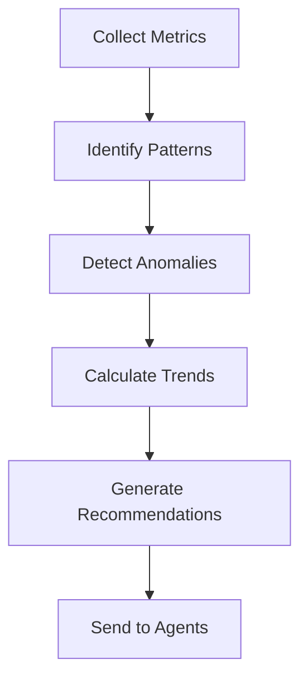

# Learning Agent Documentation

**Component**: Learning Agent  
**Status**: ✅ COMPLETE  
**Version**: 1.0.0  
**Last Updated**: January 11, 2025

## Overview

The Learning Agent is the intelligence layer of the BrandPillar AI Agents system. It continuously monitors performance across all agents, identifies optimization opportunities, and automatically improves the system without human intervention.

## Key Capabilities

### 1. Performance Analysis
- **Content Performance Aggregation**: Tracks engagement metrics across all published content
- **Voice Accuracy Tracking**: Monitors how well generated content matches user's voice profile
- **Timing Effectiveness Analysis**: Evaluates optimal posting times and their impact
- **Topic Resonance Analysis**: Identifies which topics perform best for each user
- **User Behavior Pattern Detection**: Learns from user interactions and preferences

### 2. Model Updates
- **Feedback Loop Integration**: Continuously learns from performance data
- **Parameter Optimization**: Automatically adjusts AI model parameters for better results
- **A/B Test Processing**: Analyzes experiments to identify winning variations
- **User Preference Learning**: Adapts to individual user preferences over time
- **Model Versioning**: Maintains version history with rollback capability

### 3. System Optimization
- **Agent Efficiency Monitoring**: Tracks resource usage and processing times
- **Resource Allocation Tuning**: Optimizes computational resources across agents
- **Workflow Optimization**: Streamlines inter-agent communication and task flow
- **Cost Reduction Analysis**: Identifies opportunities to reduce operational costs
- **Performance Bottleneck Detection**: Finds and resolves system slowdowns

### 4. Insight Generation
- **Performance Reports**: Generates comprehensive analytics and trends
- **Recommendation Engine**: Provides actionable suggestions for improvement
- **Trend Identification**: Spots emerging patterns and opportunities
- **Success Pattern Recognition**: Identifies what works and replicates it
- **Actionable Insights**: Formats findings into clear, implementable steps

## Architecture

### Core Components

```typescript
class LearningAgent extends BaseAgent {
  // Continuous learning cycle
  private readonly LEARNING_INTERVAL = 3600000; // 1 hour
  
  // Performance thresholds
  private readonly MIN_DATA_POINTS = 10;
  private readonly IMPROVEMENT_THRESHOLD = 0.05; // 5%
  
  // Core services
  private performanceTracker: PerformanceTrackerService;
  private supabase: SupabaseClient;
  private redis: Redis;
}
```

### Task Types

1. **ANALYZE_PERFORMANCE**: Analyzes performance metrics for specific agents or users
2. **OPTIMIZE_AGENT**: Generates and applies optimizations to specific agents
3. **GENERATE_INSIGHTS**: Creates system-wide insights and recommendations
4. **UPDATE_MODELS**: Updates AI model parameters based on learnings
5. **SYSTEM_OPTIMIZATION**: Runs comprehensive system optimization
6. **EXPERIMENT_ANALYSIS**: Analyzes A/B test results for statistical significance

## Implementation Details

### Performance Analysis Flow



### Optimization Process

1. **Data Collection**: Gathers performance data from all agents
2. **Pattern Recognition**: Identifies successful and unsuccessful patterns
3. **Hypothesis Generation**: Creates optimization hypotheses
4. **Experiment Design**: Sets up A/B tests to validate hypotheses
5. **Result Analysis**: Evaluates experiment outcomes
6. **Implementation**: Applies successful optimizations
7. **Monitoring**: Tracks impact of changes

### Learning Cycle

The agent runs a continuous learning cycle every hour:

```typescript
private async runPeriodicLearning(): Promise<void> {
  // Analyze recent performance
  const insights = await this.generateInsights({ timeRange: '1h' });
  
  // Send updates to relevant agents
  for (const recommendation of insights.recommendations) {
    await this.sendOptimizationUpdate(recommendation);
  }
  
  // Update cached metrics
  await this.updateMetricsCache();
}
```

## Integration Points

### Input Sources
- **Agent Performance Metrics**: Task completion times, error rates, resource usage
- **Content Performance**: Engagement rates, reach, clicks, shares
- **User Behavior**: Interaction patterns, preferences, feedback
- **System Metrics**: CPU, memory, network usage

### Output Targets
- **Content Generator**: Voice profile updates, content strategy adjustments
- **Quality Control**: Risk threshold adjustments, validation rule updates
- **Publisher**: Timing optimizations, platform-specific tweaks
- **News Monitor**: Relevance scoring improvements, source prioritization

## Performance Metrics

### Key Performance Indicators
- **Learning Cycle Time**: <24 hours for full system optimization
- **Performance Improvement Rate**: 5-10% monthly improvement target
- **Experiment Success Rate**: >60% of experiments show positive results
- **Model Accuracy**: Continuous improvement trajectory
- **System Health Score**: Maintains >90% health score

### Monitoring Dashboards
- Real-time performance metrics
- Agent efficiency tracking
- Content performance trends
- System resource utilization
- Optimization impact analysis

## Example Optimizations

### 1. Content Timing Optimization
```typescript
{
  targetAgent: AgentType.PUBLISHER,
  updateType: 'PARAMETER',
  updates: {
    optimalPostingTimes: [
      { hour: 9, score: 0.92 },
      { hour: 12, score: 0.88 },
      { hour: 17, score: 0.85 }
    ]
  },
  reason: 'Analysis shows 35% higher engagement at these times',
  expectedImprovement: 0.35
}
```

### 2. Voice Profile Enhancement
```typescript
{
  targetAgent: AgentType.CONTENT_GENERATOR,
  updateType: 'MODEL',
  updates: {
    temperature: 0.8,
    vocabularyEmphasis: ['innovative', 'strategic', 'data-driven'],
    sentenceComplexity: 'medium-high'
  },
  reason: 'User's audience responds better to sophisticated language',
  expectedImprovement: 0.15
}
```

### 3. Quality Threshold Adjustment
```typescript
{
  targetAgent: AgentType.QUALITY_CONTROL,
  updateType: 'PARAMETER',
  updates: {
    minimumQualityScore: 0.85,
    riskTolerance: 0.1,
    factCheckingRequired: true
  },
  reason: 'Higher quality threshold improves engagement',
  expectedImprovement: 0.20
}
```

## Configuration

### Environment Variables
```bash
# Learning Agent Configuration
LEARNING_INTERVAL=3600000      # Learning cycle interval (ms)
MIN_DATA_POINTS=10            # Minimum data points for analysis
IMPROVEMENT_THRESHOLD=0.05     # Minimum improvement to apply changes
EXPERIMENT_DURATION=86400000   # Default experiment duration (24h)
```

### Database Tables
- `agent_performance_metrics`: Stores agent performance data
- `learning_insights`: Stores generated insights and recommendations
- `optimization_history`: Tracks applied optimizations and their impact
- `experiment_results`: Stores A/B test results and analysis

## Deployment

### Local Development
```bash
# Start the Learning Agent
npm run agent:learning

# Run with debug logging
DEBUG=learning:* npm run agent:learning
```

### Production Deployment
- Deployed as part of the agent cluster on Railway
- Shares message bus and database with other agents
- Monitored via Prometheus and Grafana
- Health checks available at `/health/agents/learning`

## Future Enhancements

1. **Advanced ML Models**: Implement deep learning for pattern recognition
2. **Predictive Analytics**: Forecast future performance trends
3. **Cross-User Learning**: Learn from aggregate user data (privacy-preserving)
4. **Real-Time Optimization**: Reduce learning cycle to minutes instead of hours
5. **Explainable AI**: Provide detailed explanations for all recommendations

## Troubleshooting

### Common Issues

1. **High Memory Usage**
   - Solution: Adjust cache size in configuration
   - Monitor: Check Redis memory consumption

2. **Slow Learning Cycles**
   - Solution: Increase parallelism in analysis tasks
   - Monitor: Track cycle completion times

3. **Poor Recommendations**
   - Solution: Increase MIN_DATA_POINTS threshold
   - Monitor: Track recommendation success rate

### Debug Commands
```bash
# Check agent health
curl http://localhost:3000/health/agents/learning

# View recent insights
npm run cli -- insights:list --agent=learning

# Force learning cycle
npm run cli -- learning:trigger
```

## API Reference

### Message Types Accepted
- `TASK_REQUEST`: Initiates specific learning tasks
- `STATUS_UPDATE`: Receives status from other agents
- `COORDINATION`: Handles multi-agent coordination

### Message Types Sent
- `LEARNING_UPDATE`: Sends optimizations to other agents
- `TASK_RESULT`: Returns analysis results
- `STATUS_UPDATE`: Reports health and progress

## Conclusion

The Learning Agent transforms BrandPillar AI from a static system into a continuously evolving platform. By analyzing performance data, identifying patterns, and automatically implementing improvements, it ensures that the system gets better every day without human intervention. This creates a compound effect where small improvements accumulate into significant performance gains over time.