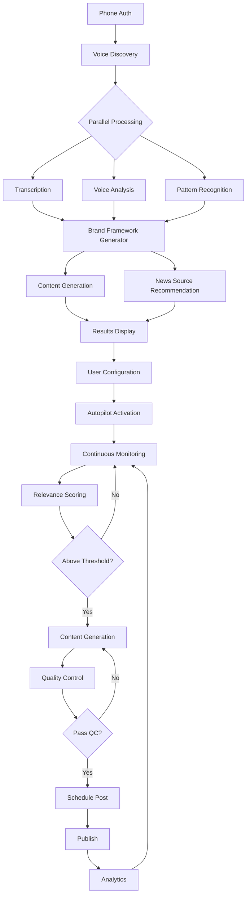

# Personal Brand DNA: Complete Product Specification Document

**Version**: 1.0  
**Date**: January 2025  
**Product Lead**: [Name]  
**Status**: Ready for Engineering

---

## Table of Contents

1. [Executive Summary](#executive-summary)
2. [Product Vision & USP](#product-vision--usp)
3. [System Architecture Overview](#system-architecture-overview)
4. [Core Features & User Journey](#core-features--user-journey)
5. [Technical Specifications](#technical-specifications)
6. [API Design & Endpoints](#api-design--endpoints)
7. [Database Schema](#database-schema)
8. [AI/ML Components](#aiml-components)
9. [Frontend Specifications](#frontend-specifications)
10. [Backend Services](#backend-services)
11. [Set & Forget Automation Engine](#set--forget-automation-engine)
12. [Security & Compliance](#security--compliance)
13. [Performance Requirements](#performance-requirements)
14. [Testing Strategy](#testing-strategy)
15. [Deployment & DevOps](#deployment--devops)
16. [Success Metrics & Analytics](#success-metrics--analytics)
17. [Implementation Timeline](#implementation-timeline)

---

## 1. Executive Summary

### Product Overview

Personal Brand DNA is the world's first truly autonomous personal branding system that discovers an individual's authentic professional voice through a 10-minute AI phone conversation, then runs on complete autopilot - generating, scheduling, and posting high-quality, voice-matched content 24/7/365 without any human intervention.

### Key Differentiators

1. **10-Minute Voice Discovery**: AI-powered phone conversation that captures complete voice DNA
2. **Instant Results**: Comprehensive brand framework with 20+ ready-to-post content pieces
3. **True Set & Forget**: Zero manual intervention required after initial setup
4. **Perfect Voice Matching**: Every piece of content sounds authentically like the user
5. **Intelligent Newsjacking**: 24/7 monitoring and timely content creation from relevant news

### Target Users

- **Primary**: Ambitious professionals (28-45, Manager-Director level, $75K-150K)
- **Secondary**: Established experts (35-55, Senior Director-VP, $150K-300K)
- **Tertiary**: Independent consultants and coaches

### Business Model

Three-tier subscription model:
- **Passive "Authority Builder"**: $49/month
- **Regular "Influence Accelerator"**: $149/month  
- **Aggressive "Market Dominator"**: $399/month

---

## 2. Product Vision & USP

### Vision Statement

> "Transform personal branding from a time-consuming daily task into a completely automated growth engine that authentically represents professionals while they focus on their actual work."

### Unique Selling Proposition

**"The only personal branding system where 'set and forget' actually means set and forget. Not 'set and check daily' or 'set and approve each post.' Literally set once and never think about it again."**

### Core Value Propositions

1. **Time Freedom**: Save 20+ hours/month on content creation
2. **Authentic Voice**: AI that sounds exactly like you, not like AI
3. **Career Growth**: Generate real opportunities through consistent presence
4. **Zero Maintenance**: Runs forever without any manual intervention
5. **Intelligent Timing**: Posts when your audience is most receptive

---

## 3. System Architecture Overview

### High-Level Architecture

```
┌─────────────────────────────────────────────────────────────────┐
│                     PERSONAL BRAND DNA SYSTEM                    │
├─────────────────────────────────────────────────────────────────┤
│                                                                 │
│  ┌─────────────────┐  ┌─────────────────┐  ┌────────────────┐ │
│  │  VOICE DISCOVERY │  │ BRAND FRAMEWORK │  │   AUTOPILOT    │ │
│  │    SYSTEM        │→ │   GENERATOR     │→ │    ENGINE      │ │
│  └─────────────────┘  └─────────────────┘  └────────────────┘ │
│           ↓                    ↓                     ↓          │
│  ┌─────────────────────────────────────────────────────────┐   │
│  │                    CORE SERVICES LAYER                   │   │
│  ├─────────────────┬─────────────────┬────────────────────┤   │
│  │ Voice Analysis  │ Content Engine  │ Distribution Hub   │   │
│  │ AI Service      │ AI Service      │ Service            │   │
│  ├─────────────────┼─────────────────┼────────────────────┤   │
│  │ News Monitoring │ Quality Control │ Analytics          │   │
│  │ Service         │ Service         │ Service            │   │
│  └─────────────────┴─────────────────┴────────────────────┘   │
│                              ↓                                  │
│  ┌─────────────────────────────────────────────────────────┐   │
│  │                    DATA LAYER                            │   │
│  ├──────────────┬──────────────┬───────────────────────────┤   │
│  │ PostgreSQL   │ Redis Cache  │ S3/Blob Storage           │   │
│  └──────────────┴──────────────┴───────────────────────────┘   │
│                                                                 │
└─────────────────────────────────────────────────────────────────┘
```

### Technology Stack

#### Frontend
- **Framework**: React 18 with TypeScript
- **State Management**: Redux Toolkit with RTK Query
- **Styling**: Tailwind CSS
- **Mobile**: React Native (future phase)
- **Build Tool**: Vite

#### Backend
- **API Layer**: Node.js with Express.js
- **Microservices**: Python FastAPI for AI services
- **Queue System**: Bull with Redis
- **Caching**: Redis
- **Search**: Elasticsearch (future phase)

#### AI/ML Stack
- **Voice Analysis**: Vapi.ai/Bland.ai for conversations
- **Transcription**: Deepgram/Google Speech-to-Text
- **NLP**: OpenAI GPT-4, Claude 3, Custom BERT models
- **Embeddings**: OpenAI Ada-2
- **Voice Synthesis**: ElevenLabs (future)

#### Infrastructure
- **Cloud Provider**: AWS/Vercel hybrid
- **Container**: Docker with Kubernetes
- **CI/CD**: GitHub Actions
- **Monitoring**: DataDog, Sentry
- **Analytics**: Mixpanel, Custom dashboards

---

## 4. Core Features & User Journey

### Complete User Journey Map

```
┌──────────────────┐     ┌──────────────────┐     ┌──────────────────┐
│ 1. PHONE AUTH    │ →   │ 2. VOICE DISCOVERY│ →   │ 3. INSTANT RESULTS│
│ (2 min)          │     │ (10 min)          │     │ (0-5 sec)         │
└──────────────────┘     └──────────────────┘     └──────────────────┘
                                                            ↓
┌──────────────────┐     ┌──────────────────┐     ┌──────────────────┐
│ 6. AUTOPILOT ∞   │ ←   │ 5. ACTIVATION     │ ←   │ 4. NEWS SETUP     │
│ (Forever)        │     │ (1 min)           │     │ (2-3 min)         │
└──────────────────┘     └──────────────────┘     └──────────────────┘
```

### Detailed Feature Specifications

#### 4.1 Phone Authentication System

**Purpose**: Passwordless authentication using phone numbers

**User Flow**:
1. User enters phone number
2. Receives SMS with 6-digit OTP
3. Enters OTP to authenticate
4. JWT session created

**Technical Requirements**:
- Twilio SMS integration
- OTP generation and validation
- Rate limiting (3 attempts per number per hour)
- OTP expiry: 10 minutes
- Secure token storage

**API Endpoints**:
```
POST /api/auth/phone/send-otp
POST /api/auth/phone/verify-otp
POST /api/auth/phone/refresh-token
```

#### 4.2 Voice Discovery System

**Purpose**: Capture user's authentic voice and communication style through AI conversation

**Conversation Structure**:
```javascript
const VOICE_DISCOVERY_QUESTIONS = [
  {
    id: 1,
    question: "In 30 seconds, tell me what you do and who you help.",
    timing: "0:30-1:30",
    purpose: "Baseline voice, energy, positioning",
    analysis: ["energy_level", "clarity", "passion_indicators"]
  },
  {
    id: 2,
    question: "Share a quick story about a recent win with a client or in your work.",
    timing: "1:30-2:30",
    purpose: "Storytelling style, success patterns",
    analysis: ["narrative_style", "emotion_expression", "detail_level"]
  },
  {
    id: 3,
    question: "What's the biggest misconception people have about your industry?",
    timing: "2:30-3:30",
    purpose: "Thought leadership, expertise depth",
    analysis: ["analytical_thinking", "industry_knowledge", "contrarian_views"]
  },
  {
    id: 4,
    question: "If you could teach one thing to everyone in your field, what would it be?",
    timing: "3:30-4:30",
    purpose: "Teaching style, core values",
    analysis: ["educational_approach", "core_beliefs", "communication_clarity"]
  },
  {
    id: 5,
    question: "Tell me about a trend in your industry that excites you right now.",
    timing: "4:30-5:30",
    purpose: "Future orientation, innovation mindset",
    analysis: ["visionary_thinking", "enthusiasm_level", "technical_depth"]
  },
  {
    id: 6,
    question: "What's the hardest part of your job that people don't see?",
    timing: "5:30-6:30",
    purpose: "Authenticity, vulnerability",
    analysis: ["honesty_markers", "emotional_intelligence", "relatability"]
  },
  {
    id: 7,
    question: "Morning person or night owl? When do you do your best thinking?",
    timing: "6:30-7:00",
    purpose: "Personal style, relatability",
    analysis: ["personal_preferences", "work_style", "casual_voice"]
  },
  {
    id: 8,
    question: "If you were famous for one thing professionally, what would you want it to be?",
    timing: "7:00-8:00",
    purpose: "Aspirations, legacy thinking",
    analysis: ["ambition_level", "core_message", "professional_identity"]
  },
  {
    id: 9,
    question: "What's one piece of advice you'd give to someone just starting in your field?",
    timing: "8:00-9:00",
    purpose: "Mentorship style, wisdom sharing",
    analysis: ["mentoring_approach", "experience_depth", "empathy_level"]
  },
  {
    id: 10,
    question: "One thing you want people to remember about you?",
    timing: "9:00-10:00",
    purpose: "Core identity capture",
    analysis: ["personal_brand_essence", "key_message", "memorable_qualities"]
  }
];
```

**Real-Time Processing**:
- Parallel transcription during call
- Voice feature extraction (pitch, pace, energy)
- Linguistic pattern analysis
- Personality trait identification
- Content pillar generation

**Voice Analysis Dimensions**:
```javascript
const VOICE_ANALYSIS_DIMENSIONS = {
  communication_style: {
    formality: 0-10,
    analytical_vs_emotional: 0-10,
    concise_vs_detailed: 0-10,
    serious_vs_playful: 0-10,
    direct_vs_diplomatic: 0-10
  },
  linguistic_patterns: {
    sentence_starters: [],
    transition_words: [],
    emphasis_patterns: [],
    signature_phrases: [],
    filler_words: []
  },
  personality_markers: {
    confidence_level: 0-10,
    empathy_expression: 0-10,
    humor_usage: 0-10,
    storytelling_ability: 0-10,
    teaching_orientation: 0-10
  },
  professional_identity: {
    expertise_display: "name-dropper|experience-based|data-driven",
    authority_style: "commanding|collaborative|suggestive",
    audience_relation: "peer|mentor|teacher|friend"
  }
};
```

#### 4.3 Instant Results & Brand Framework

**Purpose**: Deliver comprehensive personal brand analysis immediately after call

**Results Structure**:
```typescript
interface BrandFramework {
  brand_essence: {
    primary_archetype: string;
    secondary_archetype: string;
    brand_personality: string[];
    core_values: string[];
    unique_angle: string;
  };
  
  voice_profile: {
    communication_style: CommunicationStyle;
    linguistic_patterns: LinguisticPatterns;
    energy_signature: EnergySignature;
    authenticity_markers: string[];
  };
  
  value_proposition: {
    one_liner: string;
    elevator_pitch: string;
    linkedin_headline: string;
    full_statement: string;
  };
  
  target_audience: {
    primary_persona: AudiencePersona;
    pain_points: string[];
    aspirations: string[];
    engagement_triggers: string[];
  };
  
  content_pillars: ContentPillar[];
  
  generated_content: {
    [pillar_id: string]: GeneratedPost[];
  };
  
  content_calendar: {
    optimal_times: PostingTime[];
    frequency: PostingFrequency;
    content_mix: ContentDistribution;
  };
}
```

**Content Pillar Generation**:
```javascript
interface ContentPillar {
  id: string;
  name: string;
  description: string;
  weight_percentage: number;
  topics: string[];
  content_types: ContentType[];
  voice_attributes: VoiceAttributes;
  hashtag_strategy: HashtagStrategy;
  example_hooks: string[];
  engagement_potential: "high" | "medium" | "low";
}
```

**Immediate Content Generation**:
- 20+ ready-to-post pieces
- 4-5 pieces per content pillar
- Voice-matched to perfection
- Multiple content types (posts, articles, stories)

#### 4.4 News Source Configuration

**Purpose**: Set up automated content sources for continuous monitoring

**Recommended Sources Algorithm**:
```javascript
function recommendNewsSources(brandFramework) {
  return {
    industry_publications: getIndustryPublications(brandFramework.industry),
    thought_leaders: getThoughtLeaders(brandFramework.expertise_area),
    company_newsrooms: getRelevantCompanies(brandFramework.target_audience),
    trending_topics: getTrendingSources(brandFramework.content_pillars),
    competitor_blogs: getCompetitorSources(brandFramework.competitive_landscape)
  };
}
```

**User Interface Elements**:
- Pre-populated recommendations
- Easy toggle selection
- Custom RSS feed addition
- Keyword monitoring setup
- Preview of monitoring frequency

#### 4.5 Autopilot Activation

**Purpose**: Final configuration before autonomous operation begins

**Tier Selection Interface**:
```typescript
interface TierConfiguration {
  tier: "passive" | "regular" | "aggressive";
  features: {
    posts_per_week: number;
    rss_feeds: number | "unlimited";
    approval_window: number; // hours
    monitoring_frequency: string;
    advanced_features: AdvancedFeatures;
  };
  pricing: {
    monthly: number;
    annual: number;
    savings: number;
  };
}
```

**Final Confirmation Screen**:
- Summary of voice analysis
- Selected news sources
- Posting schedule preview
- Tier features
- "Activate Autopilot" button

---

## 5. Technical Specifications

### 5.1 API Architecture

#### RESTful API Design Principles
- Resource-based URLs
- HTTP methods for actions
- Stateless communication
- JSON request/response format
- Consistent error handling

#### Authentication & Authorization
```javascript
// JWT Token Structure
{
  "user_id": "uuid",
  "phone_number": "+1234567890",
  "tier": "regular",
  "permissions": ["read", "write", "publish"],
  "voice_discovery_completed": true,
  "exp": 1234567890
}
```

#### Rate Limiting
```javascript
const RATE_LIMITS = {
  unauthenticated: {
    requests_per_minute: 10,
    requests_per_hour: 100
  },
  authenticated: {
    requests_per_minute: 60,
    requests_per_hour: 1000
  },
  tier_based: {
    passive: { content_generation_per_day: 5 },
    regular: { content_generation_per_day: 15 },
    aggressive: { content_generation_per_day: 50 }
  }
};
```

### 5.2 Microservices Architecture

#### Service Breakdown
```yaml
services:
  api_gateway:
    port: 3000
    responsibilities:
      - Request routing
      - Authentication
      - Rate limiting
      - Response aggregation
  
  voice_discovery_service:
    port: 3001
    language: Node.js
    responsibilities:
      - Call initiation
      - Webhook handling
      - Transcription processing
      - Real-time analysis
  
  content_generation_service:
    port: 8001
    language: Python
    responsibilities:
      - AI content generation
      - Voice matching
      - Quality scoring
      - Multi-variant creation
  
  news_monitoring_service:
    port: 3002
    language: Node.js
    responsibilities:
      - RSS feed polling
      - News API integration
      - Relevance scoring
      - Deduplication
  
  distribution_service:
    port: 3003
    language: Node.js
    responsibilities:
      - Scheduling
      - Platform posting
      - Analytics tracking
      - Failure handling
  
  analytics_service:
    port: 3004
    language: Node.js
    responsibilities:
      - Performance tracking
      - Engagement analysis
      - Report generation
      - ML model updates
```

### 5.3 Data Flow Architecture



---

## 6. API Design & Endpoints

### 6.1 Authentication APIs

#### Send OTP
```http
POST /api/auth/phone/send-otp
Content-Type: application/json

Request:
{
  "phone_number": "+1234567890",
  "country_code": "US"
}

Response:
{
  "success": true,
  "message": "OTP sent successfully",
  "expires_in": 600,
  "attempts_remaining": 3
}
```

#### Verify OTP
```http
POST /api/auth/phone/verify-otp
Content-Type: application/json

Request:
{
  "phone_number": "+1234567890",
  "otp": "123456"
}

Response:
{
  "success": true,
  "access_token": "eyJ...",
  "refresh_token": "eyJ...",
  "user": {
    "id": "uuid",
    "phone_number": "+1234567890",
    "voice_discovery_completed": false,
    "tier": null
  }
}
```

### 6.2 Voice Discovery APIs

#### Initiate Voice Call
```http
POST /api/voice-discovery/initiate-call
Authorization: Bearer {token}

Request:
{
  "preferred_time": "immediate" | "scheduled",
  "scheduled_time": "2024-01-15T10:00:00Z"
}

Response:
{
  "call_id": "call_uuid",
  "status": "initiating",
  "estimated_duration": 600,
  "dial_in_number": "+1234567890",
  "access_code": "123456"
}
```

#### Voice Discovery Webhook
```http
POST /api/voice-discovery/webhook
X-Webhook-Secret: {secret}

Request:
{
  "call_id": "call_uuid",
  "status": "completed",
  "duration": 598,
  "recording_url": "https://...",
  "transcript": {
    "segments": [
      {
        "speaker": "assistant",
        "text": "...",
        "timestamp": 0.0
      }
    ]
  }
}
```

#### Check Analysis Status
```http
GET /api/voice-discovery/status
Authorization: Bearer {token}

Response:
{
  "status": "analyzing" | "completed" | "failed",
  "progress": 75,
  "estimated_completion": "2024-01-15T10:10:00Z",
  "stages_completed": [
    "transcription",
    "voice_analysis",
    "pattern_recognition"
  ]
}
```

### 6.3 Brand Framework APIs

#### Get Brand Framework
```http
GET /api/brand-framework
Authorization: Bearer {token}

Response:
{
  "brand_framework": {
    "brand_essence": {...},
    "voice_profile": {...},
    "value_proposition": {...},
    "target_audience": {...},
    "content_pillars": [...]
  },
  "generated_content": {
    "pillar_id_1": [...],
    "pillar_id_2": [...]
  },
  "confidence_score": 0.92
}
```

### 6.4 Content Generation APIs

#### Generate Content
```http
POST /api/content/generate
Authorization: Bearer {token}

Request:
{
  "topic": "Industry trend about AI",
  "content_type": "linkedin_post",
  "pillar": "thought_leadership",
  "urgency": "normal",
  "variations": 3
}

Response:
{
  "content_variations": [
    {
      "id": "content_uuid_1",
      "content": "...",
      "voice_match_score": 0.94,
      "predicted_engagement": 0.82,
      "metadata": {...}
    }
  ]
}
```

### 6.5 Autopilot APIs

#### Configure Autopilot
```http
POST /api/autopilot/configure
Authorization: Bearer {token}

Request:
{
  "tier": "regular",
  "news_sources": {
    "rss_feeds": [...],
    "keywords": [...],
    "google_alerts": [...]
  },
  "posting_preferences": {
    "times_per_week": 7,
    "preferred_times": ["9:00", "14:00"],
    "avoid_weekends": false
  },
  "content_preferences": {
    "pillars_weight": {...},
    "avoid_topics": [...],
    "approval_required": false
  }
}

Response:
{
  "autopilot_id": "config_uuid",
  "status": "active",
  "next_post_scheduled": "2024-01-15T09:00:00Z",
  "monitoring_active": true
}
```

#### Get Autopilot Status
```http
GET /api/autopilot/status
Authorization: Bearer {token}

Response:
{
  "status": "active",
  "posts_this_week": 5,
  "posts_scheduled": 2,
  "total_reach": 45234,
  "engagement_rate": 0.042,
  "next_post": {
    "scheduled_time": "2024-01-15T14:00:00Z",
    "topic": "AI regulation news",
    "pillar": "industry_commentary"
  },
  "monitoring": {
    "sources_active": 15,
    "news_items_processed": 234,
    "relevant_items_found": 18
  }
}
```

---

## 7. Database Schema

### 7.1 Core Tables

#### Users Table
```sql
CREATE TABLE users (
  id UUID PRIMARY KEY DEFAULT uuid_generate_v4(),
  phone_number VARCHAR(20) UNIQUE NOT NULL,
  country_code VARCHAR(5) NOT NULL,
  tier VARCHAR(20) DEFAULT 'free',
  voice_discovery_completed BOOLEAN DEFAULT FALSE,
  onboarding_completed BOOLEAN DEFAULT FALSE,
  subscription_status VARCHAR(20) DEFAULT 'inactive',
  created_at TIMESTAMP DEFAULT NOW(),
  updated_at TIMESTAMP DEFAULT NOW()
);

CREATE INDEX idx_users_phone ON users(phone_number);
CREATE INDEX idx_users_tier ON users(tier);
```

#### Voice Discoveries Table
```sql
CREATE TABLE voice_discoveries (
  id UUID PRIMARY KEY DEFAULT uuid_generate_v4(),
  user_id UUID REFERENCES users(id) ON DELETE CASCADE,
  call_id VARCHAR(255) UNIQUE,
  status VARCHAR(20) DEFAULT 'pending',
  call_duration INTEGER,
  recording_url TEXT,
  transcript JSONB,
  analysis_results JSONB,
  voice_dna JSONB,
  completed_at TIMESTAMP,
  created_at TIMESTAMP DEFAULT NOW()
);

CREATE INDEX idx_voice_discoveries_user ON voice_discoveries(user_id);
CREATE INDEX idx_voice_discoveries_status ON voice_discoveries(status);
```

#### Brand Frameworks Table
```sql
CREATE TABLE brand_frameworks (
  id UUID PRIMARY KEY DEFAULT uuid_generate_v4(),
  user_id UUID REFERENCES users(id) ON DELETE CASCADE,
  voice_discovery_id UUID REFERENCES voice_discoveries(id),
  brand_essence JSONB NOT NULL,
  voice_profile JSONB NOT NULL,
  value_proposition JSONB NOT NULL,
  target_audience JSONB NOT NULL,
  confidence_score DECIMAL(3,2),
  version INTEGER DEFAULT 1,
  is_active BOOLEAN DEFAULT TRUE,
  created_at TIMESTAMP DEFAULT NOW(),
  updated_at TIMESTAMP DEFAULT NOW()
);

CREATE INDEX idx_brand_frameworks_user ON brand_frameworks(user_id);
CREATE INDEX idx_brand_frameworks_active ON brand_frameworks(user_id, is_active);
```

#### Content Pillars Table
```sql
CREATE TABLE content_pillars (
  id UUID PRIMARY KEY DEFAULT uuid_generate_v4(),
  brand_framework_id UUID REFERENCES brand_frameworks(id) ON DELETE CASCADE,
  name VARCHAR(100) NOT NULL,
  description TEXT,
  weight_percentage INTEGER CHECK (weight_percentage BETWEEN 0 AND 100),
  topics TEXT[],
  content_types VARCHAR(50)[],
  voice_attributes JSONB,
  hashtag_strategy JSONB,
  engagement_potential VARCHAR(20),
  created_at TIMESTAMP DEFAULT NOW()
);

CREATE INDEX idx_content_pillars_framework ON content_pillars(brand_framework_id);
```

#### Generated Content Table
```sql
CREATE TABLE generated_content (
  id UUID PRIMARY KEY DEFAULT uuid_generate_v4(),
  user_id UUID REFERENCES users(id) ON DELETE CASCADE,
  pillar_id UUID REFERENCES content_pillars(id),
  content_type VARCHAR(50) NOT NULL,
  content TEXT NOT NULL,
  voice_match_score DECIMAL(3,2),
  predicted_engagement DECIMAL(3,2),
  actual_engagement DECIMAL(3,2),
  metadata JSONB,
  status VARCHAR(20) DEFAULT 'draft',
  published_at TIMESTAMP,
  created_at TIMESTAMP DEFAULT NOW()
);

CREATE INDEX idx_generated_content_user ON generated_content(user_id);
CREATE INDEX idx_generated_content_status ON generated_content(status);
CREATE INDEX idx_generated_content_published ON generated_content(published_at);
```

#### Autopilot Configurations Table
```sql
CREATE TABLE autopilot_configs (
  id UUID PRIMARY KEY DEFAULT uuid_generate_v4(),
  user_id UUID REFERENCES users(id) ON DELETE CASCADE,
  tier VARCHAR(20) NOT NULL,
  status VARCHAR(20) DEFAULT 'active',
  news_sources JSONB NOT NULL,
  posting_preferences JSONB NOT NULL,
  content_preferences JSONB NOT NULL,
  approval_settings JSONB,
  performance_metrics JSONB,
  last_post_at TIMESTAMP,
  created_at TIMESTAMP DEFAULT NOW(),
  updated_at TIMESTAMP DEFAULT NOW()
);

CREATE INDEX idx_autopilot_configs_user ON autopilot_configs(user_id);
CREATE INDEX idx_autopilot_configs_status ON autopilot_configs(status);
```

#### News Monitoring Queue Table
```sql
CREATE TABLE news_monitoring_queue (
  id UUID PRIMARY KEY DEFAULT uuid_generate_v4(),
  user_id UUID REFERENCES users(id) ON DELETE CASCADE,
  source_type VARCHAR(50) NOT NULL,
  source_url TEXT,
  news_item JSONB NOT NULL,
  relevance_score DECIMAL(3,2),
  content_angles JSONB,
  processing_status VARCHAR(20) DEFAULT 'pending',
  processed_at TIMESTAMP,
  created_at TIMESTAMP DEFAULT NOW()
);

CREATE INDEX idx_news_queue_user ON news_monitoring_queue(user_id);
CREATE INDEX idx_news_queue_status ON news_monitoring_queue(processing_status);
CREATE INDEX idx_news_queue_relevance ON news_monitoring_queue(relevance_score DESC);
```

#### Content Queue Table
```sql
CREATE TABLE content_queue (
  id UUID PRIMARY KEY DEFAULT uuid_generate_v4(),
  user_id UUID REFERENCES users(id) ON DELETE CASCADE,
  content_id UUID REFERENCES generated_content(id),
  priority_score DECIMAL(3,2),
  scheduled_time TIMESTAMP,
  approval_deadline TIMESTAMP,
  status VARCHAR(20) DEFAULT 'queued',
  platform VARCHAR(20) DEFAULT 'linkedin',
  metadata JSONB,
  created_at TIMESTAMP DEFAULT NOW()
);

CREATE INDEX idx_content_queue_user ON content_queue(user_id);
CREATE INDEX idx_content_queue_scheduled ON content_queue(scheduled_time);
CREATE INDEX idx_content_queue_status ON content_queue(status);
```

### 7.2 Analytics Tables

#### Post Performance Table
```sql
CREATE TABLE post_performance (
  id UUID PRIMARY KEY DEFAULT uuid_generate_v4(),
  content_id UUID REFERENCES generated_content(id),
  platform VARCHAR(20) NOT NULL,
  views INTEGER DEFAULT 0,
  likes INTEGER DEFAULT 0,
  comments INTEGER DEFAULT 0,
  shares INTEGER DEFAULT 0,
  clicks INTEGER DEFAULT 0,
  engagement_rate DECIMAL(5,4),
  reach INTEGER DEFAULT 0,
  impressions INTEGER DEFAULT 0,
  tracked_at TIMESTAMP DEFAULT NOW()
);

CREATE INDEX idx_post_performance_content ON post_performance(content_id);
CREATE INDEX idx_post_performance_tracked ON post_performance(tracked_at);
```

#### User Analytics Table
```sql
CREATE TABLE user_analytics (
  id UUID PRIMARY KEY DEFAULT uuid_generate_v4(),
  user_id UUID REFERENCES users(id) ON DELETE CASCADE,
  period_start DATE NOT NULL,
  period_end DATE NOT NULL,
  posts_published INTEGER DEFAULT 0,
  total_reach INTEGER DEFAULT 0,
  total_engagement INTEGER DEFAULT 0,
  average_engagement_rate DECIMAL(5,4),
  top_performing_pillar VARCHAR(100),
  audience_growth INTEGER DEFAULT 0,
  profile_views INTEGER DEFAULT 0,
  career_opportunities INTEGER DEFAULT 0,
  created_at TIMESTAMP DEFAULT NOW()
);

CREATE INDEX idx_user_analytics_user ON user_analytics(user_id);
CREATE INDEX idx_user_analytics_period ON user_analytics(period_start, period_end);
```

---

## 8. AI/ML Components

### 8.1 Voice Analysis Pipeline

#### Voice Feature Extraction
```python
class VoiceFeatureExtractor:
    def __init__(self):
        self.audio_analyzer = AudioAnalyzer()
        self.linguistic_analyzer = LinguisticAnalyzer()
        self.prosody_analyzer = ProsodyAnalyzer()
        
    def extract_features(self, audio_file, transcript):
        features = {
            'audio_features': self.extract_audio_features(audio_file),
            'linguistic_features': self.extract_linguistic_features(transcript),
            'prosody_features': self.extract_prosody_features(audio_file),
            'semantic_features': self.extract_semantic_features(transcript)
        }
        return features
    
    def extract_audio_features(self, audio_file):
        return {
            'pitch': {
                'mean': self.audio_analyzer.get_mean_pitch(audio_file),
                'variance': self.audio_analyzer.get_pitch_variance(audio_file),
                'range': self.audio_analyzer.get_pitch_range(audio_file)
            },
            'energy': {
                'mean': self.audio_analyzer.get_mean_energy(audio_file),
                'variance': self.audio_analyzer.get_energy_variance(audio_file),
                'peaks': self.audio_analyzer.get_energy_peaks(audio_file)
            },
            'pace': {
                'words_per_minute': self.audio_analyzer.get_wpm(audio_file),
                'pause_frequency': self.audio_analyzer.get_pause_frequency(audio_file),
                'pause_duration': self.audio_analyzer.get_avg_pause_duration(audio_file)
            }
        }
```

#### Voice DNA Synthesis
```python
class VoiceDNASynthesizer:
    def __init__(self):
        self.pattern_recognizer = PatternRecognizer()
        self.personality_mapper = PersonalityMapper()
        self.archetype_classifier = ArchetypeClassifier()
        
    def synthesize_voice_dna(self, features, transcript_analysis):
        voice_dna = {
            'linguistic_patterns': self.extract_linguistic_patterns(transcript_analysis),
            'communication_style': self.map_communication_style(features),
            'personality_profile': self.create_personality_profile(features),
            'brand_archetype': self.classify_archetype(features),
            'authentic_markers': self.identify_authentic_markers(transcript_analysis)
        }
        return voice_dna
    
    def extract_linguistic_patterns(self, analysis):
        return {
            'sentence_starters': self.pattern_recognizer.get_sentence_starters(analysis),
            'transition_phrases': self.pattern_recognizer.get_transitions(analysis),
            'emphasis_patterns': self.pattern_recognizer.get_emphasis(analysis),
            'signature_phrases': self.pattern_recognizer.get_signatures(analysis, min_count=3),
            'vocabulary_profile': self.pattern_recognizer.get_vocabulary_profile(analysis)
        }
```

### 8.2 Content Generation Engine

#### Multi-Model Architecture
```python
class ContentGenerationEngine:
    def __init__(self):
        self.models = {
            'gpt4': GPT4Generator(),
            'claude': ClaudeGenerator(),
            'custom_bert': CustomBERTGenerator()
        }
        self.voice_adapter = VoiceAdapter()
        self.quality_scorer = QualityScorer()
        
    async def generate_content(self, request):
        # Step 1: Prepare voice-adapted prompts
        prompts = self.prepare_prompts(request)
        
        # Step 2: Generate with multiple models
        generations = await asyncio.gather(*[
            model.generate(prompt) 
            for model, prompt in zip(self.models.values(), prompts)
        ])
        
        # Step 3: Score and rank generations
        scored_content = self.score_generations(generations, request.voice_dna)
        
        # Step 4: Select and polish best content
        best_content = self.select_best(scored_content)
        polished = self.polish_content(best_content, request.voice_dna)
        
        return polished
```

#### Voice Matching Algorithm
```python
class VoiceMatchingAlgorithm:
    def __init__(self):
        self.embedder = TextEmbedder()
        self.similarity_calculator = SimilarityCalculator()
        
    def calculate_voice_match(self, generated_content, voice_dna):
        # Extract features from generated content
        generated_features = self.extract_features(generated_content)
        
        # Compare with voice DNA
        scores = {
            'linguistic_similarity': self.compare_linguistic_patterns(
                generated_features['linguistic'],
                voice_dna['linguistic_patterns']
            ),
            'style_match': self.compare_communication_style(
                generated_features['style'],
                voice_dna['communication_style']
            ),
            'authenticity': self.measure_authenticity(
                generated_content,
                voice_dna['authentic_markers']
            )
        }
        
        # Calculate weighted score
        weights = {'linguistic_similarity': 0.4, 'style_match': 0.4, 'authenticity': 0.2}
        final_score = sum(scores[k] * weights[k] for k in scores)
        
        return final_score
```

### 8.3 Relevance Scoring System

#### News Relevance Scorer
```python
class NewsRelevanceScorer:
    def __init__(self, brand_framework):
        self.brand_pillars = brand_framework['content_pillars']
        self.target_audience = brand_framework['target_audience']
        self.embedder = SentenceTransformer('all-MiniLM-L6-v2')
        
    async def score_relevance(self, news_item):
        # Create embeddings
        news_embedding = self.embedder.encode(news_item['content'])
        pillar_embeddings = [
            self.embedder.encode(pillar['description']) 
            for pillar in self.brand_pillars
        ]
        
        # Calculate relevance scores
        pillar_scores = [
            cosine_similarity(news_embedding, pillar_emb) 
            for pillar_emb in pillar_embeddings
        ]
        
        # Additional scoring factors
        factors = {
            'pillar_alignment': max(pillar_scores),
            'audience_relevance': self.score_audience_relevance(news_item),
            'timeliness': self.score_timeliness(news_item),
            'virality_potential': self.predict_virality(news_item),
            'competition_gap': self.check_competition_coverage(news_item)
        }
        
        # Weighted final score
        weights = {
            'pillar_alignment': 0.3,
            'audience_relevance': 0.25,
            'timeliness': 0.2,
            'virality_potential': 0.15,
            'competition_gap': 0.1
        }
        
        final_score = sum(factors[k] * weights[k] for k in factors)
        return final_score, factors
```

### 8.4 Quality Control AI

#### Autonomous Quality Scorer
```python
class AutonomousQualityScorer:
    def __init__(self):
        self.readability_analyzer = ReadabilityAnalyzer()
        self.engagement_predictor = EngagementPredictor()
        self.risk_assessor = RiskAssessor()
        self.brand_checker = BrandAlignmentChecker()
        
    async def assess_quality(self, content, metadata):
        assessments = await asyncio.gather(
            self.assess_readability(content),
            self.predict_engagement(content, metadata),
            self.assess_risks(content),
            self.check_brand_alignment(content, metadata['brand_guidelines']),
            self.verify_authenticity(content, metadata['voice_dna'])
        )
        
        quality_report = {
            'readability': assessments[0],
            'predicted_engagement': assessments[1],
            'risk_assessment': assessments[2],
            'brand_alignment': assessments[3],
            'authenticity': assessments[4]
        }
        
        # Calculate composite score
        composite_score = self.calculate_composite(quality_report)
        
        # Determine action
        action = self.determine_action(composite_score, metadata['tier'])
        
        return {
            'score': composite_score,
            'action': action,
            'report': quality_report,
            'improvements': self.suggest_improvements(quality_report) if action == 'regenerate' else None
        }
```

---

## 9. Frontend Specifications

### 9.1 Component Architecture

#### Core Components Structure
```
src/
├── components/
│   ├── auth/
│   │   ├── PhoneAuthForm.tsx
│   │   ├── OTPVerification.tsx
│   │   └── AuthGuard.tsx
│   ├── voice-discovery/
│   │   ├── VoiceCallInterface.tsx
│   │   ├── ProgressIndicator.tsx
│   │   └── CallStatus.tsx
│   ├── brand-framework/
│   │   ├── BrandOverview.tsx
│   │   ├── VoiceProfile.tsx
│   │   ├── ContentPillars.tsx
│   │   └── GeneratedContent.tsx
│   ├── autopilot/
│   │   ├── NewsSourceSelector.tsx
│   │   ├── TierSelector.tsx
│   │   ├── AutopilotDashboard.tsx
│   │   └── PerformanceMetrics.tsx
│   └── shared/
│       ├── Layout.tsx
│       ├── Navigation.tsx
│       ├── LoadingStates.tsx
│       └── ErrorBoundary.tsx
├── pages/
│   ├── PhoneLogin.tsx
│   ├── VoiceDiscovery.tsx
│   ├── BrandResults.tsx
│   ├── NewsSetup.tsx
│   ├── AutopilotActivation.tsx
│   └── Dashboard.tsx
├── hooks/
│   ├── useAuth.ts
│   ├── useVoiceDiscovery.ts
│   ├── useAutopilot.ts
│   └── useAnalytics.ts
├── store/
│   ├── authSlice.ts
│   ├── brandSlice.ts
│   ├── autopilotSlice.ts
│   └── store.ts
└── utils/
    ├── api.ts
    ├── validators.ts
    └── formatters.ts
```

### 9.2 Key Component Specifications

#### Phone Authentication Component
```typescript
interface PhoneAuthFormProps {
  onSuccess: (user: User) => void;
  onError: (error: Error) => void;
}

const PhoneAuthForm: React.FC<PhoneAuthFormProps> = ({ onSuccess, onError }) => {
  const [phoneNumber, setPhoneNumber] = useState('');
  const [countryCode, setCountryCode] = useState('+1');
  const [loading, setLoading] = useState(false);
  
  const handleSubmit = async (e: FormEvent) => {
    e.preventDefault();
    setLoading(true);
    
    try {
      const response = await api.post('/auth/phone/send-otp', {
        phone_number: `${countryCode}${phoneNumber}`,
        country_code: countryCode
      });
      
      // Transition to OTP verification
      onSuccess(response.data);
    } catch (error) {
      onError(error);
    } finally {
      setLoading(false);
    }
  };
  
  return (
    <form onSubmit={handleSubmit} className="space-y-4">
      <PhoneInput
        country="US"
        value={phoneNumber}
        onChange={setPhoneNumber}
        disabled={loading}
      />
      <Button
        type="submit"
        loading={loading}
        fullWidth
      >
        Send Verification Code
      </Button>
    </form>
  );
};
```

#### Voice Discovery Progress Component
```typescript
interface VoiceDiscoveryProgressProps {
  status: 'waiting' | 'in_progress' | 'analyzing' | 'completed';
  progress: number;
}

const VoiceDiscoveryProgress: React.FC<VoiceDiscoveryProgressProps> = ({ status, progress }) => {
  const stages = [
    { id: 'voice_capture', label: 'Capturing Your Voice', icon: '🎤' },
    { id: 'pattern_analysis', label: 'Analyzing Speech Patterns', icon: '🔍' },
    { id: 'brand_creation', label: 'Creating Brand Framework', icon: '🏗️' },
    { id: 'content_generation', label: 'Generating Content', icon: '✍️' }
  ];
  
  const currentStage = Math.floor((progress / 100) * stages.length);
  
  return (
    <div className="max-w-2xl mx-auto p-8">
      <div className="space-y-8">
        {stages.map((stage, index) => (
          <div
            key={stage.id}
            className={`flex items-center space-x-4 ${
              index <= currentStage ? 'opacity-100' : 'opacity-50'
            }`}
          >
            <div className="text-3xl">{stage.icon}</div>
            <div className="flex-1">
              <h3 className="font-semibold">{stage.label}</h3>
              {index === currentStage && (
                <div className="mt-2 h-2 bg-gray-200 rounded-full overflow-hidden">
                  <div
                    className="h-full bg-blue-600 transition-all duration-500"
                    style={{ width: `${(progress % 25) * 4}%` }}
                  />
                </div>
              )}
            </div>
            {index < currentStage && (
              <CheckCircleIcon className="text-green-500 h-6 w-6" />
            )}
          </div>
        ))}
      </div>
    </div>
  );
};
```

#### Brand Results Display Component
```typescript
const BrandResultsDisplay: React.FC<{ framework: BrandFramework }> = ({ framework }) => {
  const [activeTab, setActiveTab] = useState('overview');
  
  return (
    <div className="min-h-screen bg-gradient-to-b from-blue-50 to-white">
      <div className="max-w-6xl mx-auto p-6">
        {/* Hero Section */}
        <div className="text-center mb-12">
          <h1 className="text-4xl font-bold mb-4">
            🎉 Your Personal Brand DNA is Ready!
          </h1>
          <div className="flex justify-center gap-8 mt-8">
            <QuickStat
              icon="🎯"
              label="Brand Archetype"
              value={framework.brand_essence.primary_archetype}
            />
            <QuickStat
              icon="💬"
              label="Voice Match"
              value={`${framework.confidence_score}%`}
            />
            <QuickStat
              icon="📊"
              label="Content Pillars"
              value={framework.content_pillars.length}
            />
          </div>
        </div>
        
        {/* Tabbed Content */}
        <Tabs value={activeTab} onChange={setActiveTab}>
          <TabsList>
            <Tab value="overview">Overview</Tab>
            <Tab value="voice">Voice Profile</Tab>
            <Tab value="pillars">Content Strategy</Tab>
            <Tab value="content">Generated Content</Tab>
          </TabsList>
          
          <TabsContent value="overview">
            <BrandOverview data={framework.brand_essence} />
          </TabsContent>
          
          <TabsContent value="voice">
            <VoiceProfileVisual data={framework.voice_profile} />
          </TabsContent>
          
          <TabsContent value="pillars">
            <ContentPillarsDisplay pillars={framework.content_pillars} />
          </TabsContent>
          
          <TabsContent value="content">
            <GeneratedContentGallery content={framework.generated_content} />
          </TabsContent>
        </Tabs>
        
        {/* CTA Section */}
        <div className="mt-12 text-center">
          <Button size="large" onClick={() => navigate('/news-setup')}>
            Next: Set Up Your Autopilot →
          </Button>
        </div>
      </div>
    </div>
  );
};
```

### 9.3 State Management

#### Redux Store Structure
```typescript
interface RootState {
  auth: {
    user: User | null;
    isAuthenticated: boolean;
    loading: boolean;
  };
  brand: {
    framework: BrandFramework | null;
    generatedContent: GeneratedContent[];
    loading: boolean;
  };
  autopilot: {
    config: AutopilotConfig | null;
    status: 'inactive' | 'active' | 'paused';
    metrics: AutopilotMetrics;
  };
  ui: {
    notifications: Notification[];
    modals: Modal[];
  };
}
```

---

## 10. Backend Services

### 10.1 Voice Discovery Service

```javascript
class VoiceDiscoveryService {
  constructor() {
    this.voiceProvider = new VapiClient(process.env.VAPI_API_KEY);
    this.transcriptionService = new TranscriptionService();
    this.analysisQueue = new Queue('voice-analysis');
  }
  
  async initiateCall(userId, phoneNumber) {
    // Create call session
    const session = await this.createSession(userId);
    
    // Configure AI assistant
    const assistant = {
      voice: 'professional-female',
      first_message: "Hi! I'm excited to learn about your professional story...",
      prompts: this.getDiscoveryPrompts(),
      webhook_url: `${process.env.API_URL}/voice-discovery/webhook`
    };
    
    // Initiate call
    const call = await this.voiceProvider.createCall({
      phone_number: phoneNumber,
      assistant,
      metadata: { user_id: userId, session_id: session.id }
    });
    
    return {
      call_id: call.id,
      session_id: session.id,
      status: 'initiating'
    };
  }
  
  async processWebhook(payload) {
    const { call_id, status, recording_url, transcript } = payload;
    
    if (status === 'completed') {
      // Update call record
      await this.updateCallRecord(call_id, { status, recording_url });
      
      // Queue for analysis
      await this.analysisQueue.add('analyze-voice', {
        call_id,
        transcript,
        recording_url,
        user_id: payload.metadata.user_id
      });
    }
    
    return { success: true };
  }
  
  async analyzeVoice(jobData) {
    const { transcript, recording_url, user_id } = jobData;
    
    // Parallel analysis tasks
    const [
      voiceFeatures,
      linguisticAnalysis,
      personalityProfile,
      brandFramework
    ] = await Promise.all([
      this.extractVoiceFeatures(recording_url),
      this.analyzeLinguisticPatterns(transcript),
      this.createPersonalityProfile(transcript),
      this.generateBrandFramework(transcript)
    ]);
    
    // Synthesize results
    const voiceDNA = this.synthesizeVoiceDNA({
      voiceFeatures,
      linguisticAnalysis,
      personalityProfile
    });
    
    // Generate initial content
    const generatedContent = await this.generateInitialContent(voiceDNA, brandFramework);
    
    // Save results
    await this.saveAnalysisResults(user_id, {
      voiceDNA,
      brandFramework,
      generatedContent
    });
    
    return { success: true };
  }
}
```

### 10.2 Content Generation Service

```javascript
class ContentGenerationService {
  constructor() {
    this.openai = new OpenAI({ apiKey: process.env.OPENAI_API_KEY });
    this.contentQueue = new Queue('content-generation');
    this.voiceAdapter = new VoiceAdapter();
  }
  
  async generateContent(request) {
    const { topic, voiceDNA, contentType, pillar } = request;
    
    // Build voice-adapted prompt
    const prompt = this.buildVoiceAdaptedPrompt({
      topic,
      voiceDNA,
      contentType,
      pillar
    });
    
    // Generate variations
    const variations = await this.generateVariations(prompt, 3);
    
    // Score each variation
    const scoredVariations = await Promise.all(
      variations.map(async (content) => ({
        content,
        voiceMatch: await this.scoreVoiceMatch(content, voiceDNA),
        predictedEngagement: await this.predictEngagement(content),
        qualityScore: await this.assessQuality(content)
      }))
    );
    
    // Select best
    const best = this.selectBestVariation(scoredVariations);
    
    // Apply final polish
    const polished = await this.polishContent(best, voiceDNA);
    
    return polished;
  }
  
  buildVoiceAdaptedPrompt({ topic, voiceDNA, contentType, pillar }) {
    return `
    Create a ${contentType} about "${topic}" that sounds EXACTLY like this person speaks.
    
    VOICE DNA:
    - Sentence starters: ${voiceDNA.linguistic_patterns.sentence_starters.join(', ')}
    - Transition words: ${voiceDNA.linguistic_patterns.transitions.join(', ')}
    - Energy level: ${voiceDNA.energy_signature}
    - Formality: ${voiceDNA.communication_style.formality}/10
    - Humor usage: ${voiceDNA.personality_markers.humor_usage}/10
    
    CONTENT REQUIREMENTS:
    - Pillar: ${pillar.name}
    - Tone: ${pillar.voice_attributes.tone}
    - Length: ${this.getLength(contentType)}
    - Include their signature phrases naturally
    - Match their typical paragraph structure
    
    CRITICAL: Make it sound like they're speaking, not like AI wrote it.
    `;
  }
}
```

### 10.3 Autopilot Engine Service

```javascript
class AutopilotEngine {
  constructor() {
    this.newsMonitor = new NewsMonitoringService();
    this.relevanceScorer = new RelevanceScorer();
    this.contentGenerator = new ContentGenerationService();
    this.scheduler = new ContentScheduler();
    this.publisher = new PublishingService();
  }
  
  async startAutopilot(userId, config) {
    // Initialize monitoring
    await this.newsMonitor.startMonitoring(userId, config.news_sources);
    
    // Set up scheduled jobs
    this.scheduleContentGeneration(userId, config);
    this.schedulePublishing(userId, config);
    this.scheduleAnalytics(userId);
    
    // Update status
    await this.updateAutopilotStatus(userId, 'active');
    
    return { status: 'active', message: 'Autopilot engaged' };
  }
  
  async processNewsItem(userId, newsItem) {
    // Score relevance
    const relevanceScore = await this.relevanceScorer.score(newsItem, userId);
    
    if (relevanceScore < 0.7) return;
    
    // Generate content angles
    const angles = await this.generateContentAngles(newsItem);
    
    // Select best angle
    const selectedAngle = await this.selectBestAngle(angles, userId);
    
    // Generate content
    const content = await this.contentGenerator.generateNewsjacking({
      newsItem,
      angle: selectedAngle,
      userId
    });
    
    // Queue for publishing
    await this.scheduler.queueContent(userId, content);
  }
  
  async executeScheduledPost(userId) {
    // Get next content from queue
    const nextContent = await this.scheduler.getNext(userId);
    
    if (!nextContent) {
      // Generate evergreen content if queue empty
      return this.generateEvergreenContent(userId);
    }
    
    // Quality check
    const qualityCheck = await this.performQualityCheck(nextContent);
    
    if (qualityCheck.passed) {
      // Publish
      await this.publisher.publish(nextContent);
    } else {
      // Regenerate
      await this.regenerateContent(nextContent);
    }
  }
}
```

---

## 11. Set & Forget Automation Engine

### 11.1 Core Automation Components

#### Intelligent Input Layer
```javascript
class IntelligentInputLayer {
  constructor() {
    this.sources = {
      rss: new RSSAggregator(),
      news: new NewsAPIMonitor(),
      social: new SocialTrendMonitor(),
      google: new GoogleAlertsMonitor(),
      competitors: new CompetitorMonitor()
    };
  }
  
  async startContinuousMonitoring(userId, config) {
    const monitoringJobs = [];
    
    // RSS Feeds
    config.rss_feeds.forEach(feed => {
      monitoringJobs.push(
        this.sources.rss.monitor(feed, {
          interval: this.getInterval(config.tier),
          onNewItem: (item) => this.processNewItem(userId, item, 'rss')
        })
      );
    });
    
    // Google Alerts
    config.google_alerts.forEach(alert => {
      monitoringJobs.push(
        this.sources.google.monitor(alert, {
          interval: this.getInterval(config.tier),
          onNewItem: (item) => this.processNewItem(userId, item, 'google_alert')
        })
      );
    });
    
    // Start all monitoring jobs
    await Promise.all(monitoringJobs);
  }
  
  async processNewItem(userId, item, sourceType) {
    // Enrich item with metadata
    const enriched = await this.enrichItem(item, sourceType);
    
    // Check for duplicates
    if (await this.isDuplicate(enriched)) return;
    
    // Queue for relevance scoring
    await this.queueForScoring(userId, enriched);
  }
  
  getInterval(tier) {
    const intervals = {
      passive: 60 * 60 * 1000,    // 1 hour
      regular: 30 * 60 * 1000,    // 30 minutes
      aggressive: 10 * 60 * 1000  // 10 minutes
    };
    return intervals[tier];
  }
}
```

#### Relevance & Decision Engine
```javascript
class RelevanceDecisionEngine {
  constructor() {
    this.scorer = new RelevanceScorer();
    this.angleGenerator = new AngleGenerator();
    this.timingOptimizer = new TimingOptimizer();
  }
  
  async evaluateContent(userId, item) {
    // Get user's brand framework
    const framework = await this.getUserFramework(userId);
    
    // Multi-dimensional scoring
    const scores = {
      brand_alignment: await this.scoreBrandAlignment(item, framework),
      audience_relevance: await this.scoreAudienceRelevance(item, framework),
      timeliness: this.scoreTimeliness(item),
      uniqueness: await this.scoreUniqueness(item),
      viral_potential: await this.predictVirality(item),
      competition_gap: await this.checkCompetitionGap(item)
    };
    
    // Calculate weighted score
    const finalScore = this.calculateWeightedScore(scores, framework.weights);
    
    if (finalScore >= this.getThreshold(framework.tier)) {
      // Generate content angles
      const angles = await this.angleGenerator.generate(item, framework);
      
      // Select best angle
      const selectedAngle = await this.selectBestAngle(angles, framework);
      
      // Determine optimal timing
      const timing = await this.timingOptimizer.optimize(item, selectedAngle);
      
      return {
        shouldCreate: true,
        score: finalScore,
        angle: selectedAngle,
        timing,
        confidence: this.calculateConfidence(scores)
      };
    }
    
    return { shouldCreate: false, score: finalScore };
  }
}
```

#### Autonomous Quality Control
```javascript
class AutonomousQualityControl {
  constructor() {
    this.qualityCheckers = {
      readability: new ReadabilityChecker(),
      engagement: new EngagementPredictor(),
      brand: new BrandAlignmentChecker(),
      risk: new RiskAssessment(),
      authenticity: new AuthenticityScorer()
    };
  }
  
  async performQualityCheck(content, metadata) {
    // Run all quality checks in parallel
    const checks = await Promise.all([
      this.qualityCheckers.readability.check(content),
      this.qualityCheckers.engagement.predict(content, metadata),
      this.qualityCheckers.brand.verify(content, metadata.brand_guidelines),
      this.qualityCheckers.risk.assess(content),
      this.qualityCheckers.authenticity.score(content, metadata.voice_dna)
    ]);
    
    // Compile results
    const results = {
      readability: checks[0],
      predicted_engagement: checks[1],
      brand_alignment: checks[2],
      risk_assessment: checks[3],
      authenticity: checks[4]
    };
    
    // Calculate composite score
    const compositeScore = this.calculateComposite(results);
    
    // Determine action based on tier
    const threshold = this.getThreshold(metadata.tier);
    
    if (compositeScore >= threshold) {
      return {
        passed: true,
        score: compositeScore,
        action: 'publish',
        results
      };
    } else {
      return {
        passed: false,
        score: compositeScore,
        action: 'regenerate',
        results,
        improvements: this.suggestImprovements(results)
      };
    }
  }
}
```

### 11.2 Self-Healing & Learning System

```javascript
class SelfHealingSystem {
  constructor() {
    this.diagnostics = new DiagnosticsEngine();
    this.remediation = new RemediationEngine();
    this.learning = new LearningEngine();
  }
  
  async runDiagnostics(userId) {
    const issues = [];
    
    // Check for performance issues
    const performanceIssues = await this.diagnostics.checkPerformance(userId);
    issues.push(...performanceIssues);
    
    // Check for content issues
    const contentIssues = await this.diagnostics.checkContent(userId);
    issues.push(...contentIssues);
    
    // Check for voice drift
    const voiceIssues = await this.diagnostics.checkVoiceConsistency(userId);
    issues.push(...voiceIssues);
    
    return issues;
  }
  
  async healIssues(issues) {
    for (const issue of issues) {
      switch (issue.type) {
        case 'low_engagement':
          await this.remediation.improveEngagement(issue);
          break;
        case 'voice_drift':
          await this.remediation.recalibrateVoice(issue);
          break;
        case 'content_fatigue':
          await this.remediation.refreshContentStrategy(issue);
          break;
        case 'timing_suboptimal':
          await this.remediation.optimizeTiming(issue);
          break;
      }
      
      // Learn from the fix
      await this.learning.recordRemediation(issue);
    }
  }
  
  async continuousImprovement(userId) {
    // Analyze recent performance
    const performance = await this.analyzeRecentPerformance(userId);
    
    // Update models
    await this.learning.updateModels({
      engagement_model: performance.engagement_data,
      timing_model: performance.timing_data,
      content_model: performance.content_data
    });
    
    // Evolve strategies
    await this.evolveStrategies(userId, performance);
  }
}
```

---

## 12. Security & Compliance

### 12.1 Security Architecture

#### Authentication & Authorization
```javascript
const securityConfig = {
  jwt: {
    algorithm: 'RS256',
    accessTokenExpiry: '24h',
    refreshTokenExpiry: '30d',
    issuer: 'personal-brand-dna'
  },
  
  encryption: {
    algorithm: 'AES-256-GCM',
    keyRotation: '90d',
    sensitiveFields: ['phone_number', 'recording_url', 'transcript']
  },
  
  rateLimit: {
    windowMs: 15 * 60 * 1000, // 15 minutes
    max: 100, // requests per window
    skipSuccessfulRequests: false
  },
  
  cors: {
    origin: process.env.ALLOWED_ORIGINS?.split(',') || ['http://localhost:3000'],
    credentials: true
  }
};
```

#### Data Protection
```javascript
class DataProtection {
  // Encrypt sensitive data before storage
  async encryptSensitiveData(data) {
    const encrypted = {};
    
    for (const [key, value] of Object.entries(data)) {
      if (this.isSensitiveField(key)) {
        encrypted[key] = await this.encrypt(value);
      } else {
        encrypted[key] = value;
      }
    }
    
    return encrypted;
  }
  
  // GDPR compliance
  async handleDataDeletion(userId) {
    // Delete user data
    await this.deleteUserData(userId);
    
    // Delete generated content
    await this.deleteGeneratedContent(userId);
    
    // Delete analytics
    await this.deleteAnalytics(userId);
    
    // Delete from ML training data
    await this.removeFromMLData(userId);
    
    // Audit log
    await this.auditLog('user_data_deleted', { userId });
  }
}
```

### 12.2 Compliance Requirements

#### Privacy Compliance
```javascript
const privacyCompliance = {
  gdpr: {
    dataRetention: '2 years',
    rightToAccess: true,
    rightToDelete: true,
    rightToPortability: true,
    consentManagement: true
  },
  
  ccpa: {
    optOut: true,
    dataDisclosure: true,
    nondiscrimination: true
  },
  
  dataMinimization: {
    voiceRecordings: 'delete_after_analysis',
    transcripts: 'anonymize_after_30_days',
    analytics: 'aggregate_only'
  }
};
```

---

## 13. Performance Requirements

### 13.1 Response Time Requirements

```javascript
const performanceTargets = {
  api: {
    p50: 100,  // ms
    p95: 300,  // ms
    p99: 1000  // ms
  },
  
  voiceAnalysis: {
    target: 30,    // seconds
    maximum: 60    // seconds
  },
  
  contentGeneration: {
    single: 5,     // seconds
    bulk: 30       // seconds for 20 pieces
  },
  
  pageLoad: {
    initial: 3,    // seconds
    subsequent: 1  // second
  }
};
```

### 13.2 Scalability Requirements

```javascript
const scalabilityTargets = {
  concurrent_users: 10000,
  requests_per_second: 1000,
  content_generation_per_hour: 50000,
  storage_growth: '1TB/month',
  
  infrastructure: {
    auto_scaling: true,
    multi_region: true,
    cdn_enabled: true,
    database_replicas: 3
  }
};
```

---

## 14. Testing Strategy

### 14.1 Test Coverage Requirements

```javascript
const testCoverage = {
  unit: {
    target: 80,
    critical_paths: 95
  },
  
  integration: {
    api_endpoints: 100,
    service_communication: 100
  },
  
  e2e: {
    user_journeys: [
      'phone_auth_to_activation',
      'voice_discovery_flow',
      'autopilot_setup',
      'content_generation',
      'news_monitoring'
    ]
  },
  
  performance: {
    load_testing: '1000_concurrent_users',
    stress_testing: '5x_normal_load',
    endurance_testing: '24_hours'
  }
};
```

### 14.2 Testing Automation

```javascript
const testAutomation = {
  ci_cd: {
    pre_commit: ['lint', 'unit_tests'],
    pre_merge: ['integration_tests', 'e2e_tests'],
    pre_deploy: ['performance_tests', 'security_scan']
  },
  
  monitoring: {
    synthetic_tests: '5_minute_interval',
    real_user_monitoring: true,
    error_tracking: 'sentry',
    performance_monitoring: 'datadog'
  }
};
```

---

## 15. Deployment & DevOps

### 15.1 Deployment Architecture

```yaml
deployment:
  environments:
    development:
      provider: local/docker
      database: postgres_local
      services: all
    
    staging:
      provider: aws
      region: us-east-1
      database: rds_postgres
      services: kubernetes
    
    production:
      provider: aws_multi_region
      regions: [us-east-1, us-west-2, eu-west-1]
      database: rds_multi_az
      services: eks
      cdn: cloudfront
      
  ci_cd:
    pipeline: github_actions
    stages:
      - build
      - test
      - security_scan
      - deploy_staging
      - integration_tests
      - deploy_production
    
  infrastructure_as_code:
    tool: terraform
    modules:
      - networking
      - compute
      - database
      - storage
      - monitoring
```

### 15.2 Monitoring & Observability

```javascript
const observability = {
  metrics: {
    application: [
      'request_rate',
      'error_rate',
      'response_time',
      'user_sessions'
    ],
    business: [
      'content_generated',
      'autopilot_activations',
      'user_engagement',
      'subscription_revenue'
    ]
  },
  
  logging: {
    structure: 'json',
    levels: ['error', 'warn', 'info', 'debug'],
    retention: '30_days',
    aggregation: 'elasticsearch'
  },
  
  tracing: {
    tool: 'opentelemetry',
    sample_rate: 0.1,
    critical_paths: 1.0
  },
  
  alerting: {
    channels: ['pagerduty', 'slack', 'email'],
    escalation_policy: true,
    runbooks: true
  }
};
```

---

## 16. Success Metrics & Analytics

### 16.1 Key Performance Indicators

```javascript
const kpis = {
  user_metrics: {
    activation_rate: {
      target: 0.8,
      calculation: 'users_completed_voice_discovery / total_signups'
    },
    autopilot_adoption: {
      target: 0.7,
      calculation: 'users_activated_autopilot / users_completed_discovery'
    },
    retention_30_day: {
      target: 0.85,
      calculation: 'active_users_day_30 / cohort_size'
    }
  },
  
  engagement_metrics: {
    content_usage_rate: {
      target: 0.8,
      calculation: 'content_published / content_generated'
    },
    voice_satisfaction: {
      target: 0.9,
      calculation: 'positive_voice_feedback / total_feedback'
    },
    intervention_rate: {
      target: 0.1,
      calculation: 'manual_interventions / total_posts'
    }
  },
  
  business_metrics: {
    mrr_growth: {
      target: 0.15,
      calculation: 'month_over_month_growth'
    },
    ltv_cac_ratio: {
      target: 3,
      calculation: 'lifetime_value / customer_acquisition_cost'
    },
    tier_upgrade_rate: {
      target: 0.2,
      calculation: 'tier_upgrades / eligible_users'
    }
  }
};
```

### 16.2 Analytics Implementation

```javascript
class AnalyticsService {
  constructor() {
    this.mixpanel = new Mixpanel(process.env.MIXPANEL_TOKEN);
    this.amplitude = new Amplitude(process.env.AMPLITUDE_KEY);
    this.dataWarehouse = new BigQuery();
  }
  
  // Track user events
  async trackEvent(userId, eventName, properties) {
    // Send to real-time analytics
    await Promise.all([
      this.mixpanel.track(eventName, {
        distinct_id: userId,
        ...properties
      }),
      this.amplitude.logEvent({
        user_id: userId,
        event_type: eventName,
        event_properties: properties
      })
    ]);
    
    // Store in data warehouse
    await this.dataWarehouse.insert('events', {
      user_id: userId,
      event_name: eventName,
      properties,
      timestamp: new Date()
    });
  }
  
  // Generate reports
  async generateDailyReport() {
    const metrics = await this.calculateDailyMetrics();
    const report = this.formatReport(metrics);
    await this.sendReport(report);
  }
}
```

---

## 17. Implementation Timeline

### Phase 1: Foundation (Weeks 1-2)
- [ ] Set up development environment
- [ ] Implement phone authentication
- [ ] Create basic UI components
- [ ] Set up database schema
- [ ] Implement JWT authentication

### Phase 2: Voice Discovery (Weeks 3-4)
- [ ] Integrate Vapi.ai/Bland.ai
- [ ] Implement voice call flow
- [ ] Build transcription processing
- [ ] Create voice analysis pipeline
- [ ] Implement real-time progress tracking

### Phase 3: Brand Framework Generation (Weeks 5-6)
- [ ] Build AI analysis engine
- [ ] Implement brand archetype classification
- [ ] Create content pillar generation
- [ ] Build initial content generation
- [ ] Design results display UI

### Phase 4: Autopilot Engine (Weeks 7-9)
- [ ] Implement news monitoring system
- [ ] Build relevance scoring engine
- [ ] Create content generation queue
- [ ] Implement scheduling system
- [ ] Build quality control system

### Phase 5: Set & Forget Automation (Weeks 10-11)
- [ ] Implement continuous monitoring
- [ ] Build self-healing system
- [ ] Create learning algorithms
- [ ] Implement predictive maintenance
- [ ] Design minimal UI

### Phase 6: Testing & Optimization (Weeks 12-13)
- [ ] Comprehensive testing
- [ ] Performance optimization
- [ ] Security audit
- [ ] Load testing
- [ ] Beta user testing

### Phase 7: Launch Preparation (Weeks 14-15)
- [ ] Production deployment
- [ ] Monitoring setup
- [ ] Documentation completion
- [ ] Team training
- [ ] Marketing preparation

### Phase 8: Post-Launch (Ongoing)
- [ ] User feedback integration
- [ ] Performance monitoring
- [ ] Feature iterations
- [ ] Scaling optimization
- [ ] Business metrics tracking

---

## Appendices

### A. API Error Codes

```javascript
const ERROR_CODES = {
  // Authentication errors (1xxx)
  1001: 'Invalid phone number format',
  1002: 'OTP expired',
  1003: 'Invalid OTP',
  1004: 'Too many attempts',
  
  // Voice discovery errors (2xxx)
  2001: 'Call initiation failed',
  2002: 'Transcription failed',
  2003: 'Analysis timeout',
  
  // Content generation errors (3xxx)
  3001: 'Generation failed',
  3002: 'Voice matching failed',
  3003: 'Quality check failed',
  
  // Autopilot errors (4xxx)
  4001: 'Monitoring setup failed',
  4002: 'Publishing failed',
  4003: 'Quota exceeded'
};
```

### B. Voice Analysis Dimensions Reference

```javascript
const VOICE_DIMENSIONS = {
  communication_style: {
    formality: 'How formal vs casual their communication is',
    analytical_emotional: 'Data-driven vs feeling-driven',
    concise_detailed: 'Brief vs comprehensive',
    serious_playful: 'Professional vs humorous',
    direct_diplomatic: 'Straightforward vs tactful'
  },
  
  personality_markers: {
    confidence: 'Self-assurance in communication',
    empathy: 'Understanding and relating to others',
    enthusiasm: 'Energy and passion levels',
    authenticity: 'Genuine vs performative',
    leadership: 'Authority and influence style'
  },
  
  linguistic_patterns: {
    vocabulary_complexity: 'Simple vs sophisticated word choice',
    sentence_structure: 'Simple vs complex sentences',
    rhetorical_devices: 'Use of questions, repetition, etc',
    storytelling: 'Narrative vs factual presentation',
    persuasion: 'Convincing vs informative'
  }
};
```

### C. Content Type Templates

```javascript
const CONTENT_TEMPLATES = {
  linkedin_post: {
    thought_leadership: {
      structure: ['hook', 'insight', 'evidence', 'implication', 'cta'],
      length: '150-300 words',
      tone: 'authoritative yet accessible'
    },
    personal_story: {
      structure: ['scene', 'challenge', 'action', 'result', 'lesson'],
      length: '200-400 words',
      tone: 'warm and relatable'
    },
    industry_news: {
      structure: ['news_hook', 'context', 'analysis', 'prediction', 'question'],
      length: '100-250 words',
      tone: 'informed and analytical'
    }
  }
};
```

---

**End of Product Specification Document**

This specification provides comprehensive guidance for engineering teams to implement the Personal Brand DNA system. All features, APIs, and technical requirements are detailed to enable immediate development start.